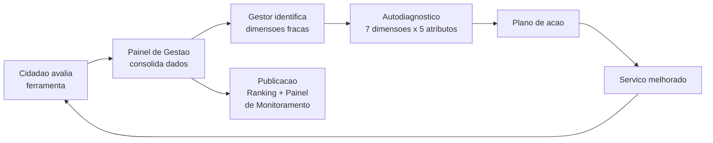

# Central de Qualidade — gov.br

> Peça estratégica do modelo federal. Define o "para quê" e o "como comparar". A ferramenta operacional (formulário, API, painel) é tratada em [ferramenta-de-avaliacao.md](./ferramenta-de-avaliacao.md).

## O que é

`[FATO]` A Central de Qualidade se apresenta como: *"um espaço integrativo indutor de pontes de aproximação entre o cidadão e o governo digital com foco na qualidade da oferta de serviços públicos digitais."* Fonte: [Central de Qualidade — Governo Digital](https://www.gov.br/governodigital/pt-br/estrategias-e-governanca-digital/transformacao-digital/central-de-qualidade).

`[FATO]` Missão declarada: *"ajuda gestores públicos a melhorar a qualidade dos serviços digitais para os cidadãos, oferecendo boas práticas, materiais orientadores, metodologias e ferramentas."*

`[INTERPRETAÇÃO]` Na prática: a Central é o **guarda-chuva** que embala a Ferramenta de Avaliação, os Padrões de Qualidade, o Autodiagnóstico, os Selos de Maturidade e o Painel de Gestão sob uma governança única.

## Quem coordena

- **Secretaria de Governo Digital (SGD/MGI)** — coordenação estratégica e responsável normativo.
- **LabQ (Laboratório de Qualidade de Serviços Públicos do Governo Digital Federal)** — braço operacional. Laboratório de experimentação e redesenho de serviços.
- **Contato de apoio:** `labq@gestao.gov.br`.

`[FATO]` Data de referência do documento oficial: publicado em 12/08/2022; última atualização em 06/07/2026. Fonte: metadata da página Central de Qualidade.

## Quatro pilares

`[FATO]` A Central se estrutura em quatro produtos:

1. **Avaliação de Satisfação do Usuário** — o formulário do cidadão.
2. **Utilidade das Informações na Página do Serviço** — qualidade do conteúdo publicado (clareza, prazos, requisitos).
3. **Autodiagnóstico de Qualidade de Serviços Digitais** — instrumento interno do gestor, calcado nas 7 dimensões.
4. **Selos de Maturidade Digital** — reconhecimento público dos serviços que atingem determinados níveis.

Fonte: Central de Qualidade.

## Framework: 7 dimensões × 5 atributos

`[FATO]` Os **padrões de qualidade** federais organizam-se assim:

> *"Os padrões de qualidade são expressos em 7 (sete) dimensões que se desdobram em 5 (cinco) atributos"* — total: **35 padrões**. Fonte: [Padrões de Qualidade para Serviços Públicos Digitais](https://www.gov.br/governodigital/pt-br/estrategias-e-governanca-digital/transformacao-digital/central-de-qualidade/padroes-de-qualidade).

As sete dimensões:

| # | Dimensão | Foco |
|---|---|---|
| 1 | Facilidade | canais digitais, uso de login gov.br |
| 2 | Comunicação | informações atualizadas, notificações de status |
| 3 | Atendimento | múltiplos canais de suporte |
| 4 | Experiência unificada | integração em fluxo único |
| 5 | Acessibilidade | soluções como VLibras, padrões ABNT |
| 6 | Privacidade e segurança | proteção de dados pessoais |
| 7 | Escuta ativa | avaliações e testes com usuários |

`[INTERPRETAÇÃO]` As 7 dimensões são a "régua" da gestão — usada no Autodiagnóstico e nos Selos. **Não** são as opções que aparecem para o cidadão no formulário (o cidadão vê 6 cards de motivos positivos, ver [ferramenta-de-avaliacao.md](./ferramenta-de-avaliacao.md)).

## Papel na avaliação de serviços digitais

`[FATO]` Da própria página: o Painel de Gestão *"reúne dados e encaminhamentos personalizados que possibilitam a evolução contínua dos serviços prestados."* As notas são *"consolidadas, publicizadas e disponíveis publicamente"* no Portal GOV.BR, no Painel de Monitoramento de Serviços e no Ranking de Serviços e Órgãos.

`[FATO]` **Indicadores atuais publicados** (na data de acesso): 1.047 serviços integrados; nota média geral 4,39/5.

## Base legal

- **Portaria SGD/MGI nº 1.083, de 14/02/2025** — dispositivo vigente. *"Dispõe sobre a avaliação de satisfação dos usuários e estabelece padrões de qualidade."* Fonte: [Biblioteca Digital MGI](https://bibliotecadigital.gestao.gov.br/handle/123456789/533149).
- **Portaria SGD/MGI nº 6.618, de 25/09/2024** — Estratégia Federal de Governo Digital.
- **Portaria SGD/ME nº 548, de 24/01/2022** — instituiu o modelo (foi o marco anterior; revisada em 2025).

## Ciclo de melhoria

`[INTERPRETAÇÃO]` A Central fecha o loop: cidadão avalia → dado vai para o gestor → gestor tem instrumento (autodiagnóstico) → executa plano → cidadão nota diferença → avalia de novo. É o desenho ideal; a maturidade real varia por órgão.

## Aplicabilidade ao MS

`[RECOMENDAÇÃO]` O MS pode replicar o modelo em três camadas:

1. **Formulário do cidadão** — copiar o padrão gov.br (ver [ferramenta-de-avaliacao.md](./ferramenta-de-avaliacao.md)).
2. **Framework de dimensões** — adotar as 7 dimensões federais como referência interna, ajustando o número de atributos conforme capacidade da SETDIG.
3. **Painel de Gestão + Ranking interno** — imprescindível para o loop de melhoria funcionar. Sem painel, a coleta vira dado morto.

`[HIPÓTESE]` Um "LabQ-MS" (equivalente estadual do laboratório federal) seria o dono natural desse produto — pode nascer como célula pequena dentro da SGD/SETDIG e crescer conforme a demanda.

## Fontes

- Central de Qualidade — https://www.gov.br/governodigital/pt-br/estrategias-e-governanca-digital/transformacao-digital/central-de-qualidade
- Padrões de Qualidade — https://www.gov.br/governodigital/pt-br/estrategias-e-governanca-digital/transformacao-digital/central-de-qualidade/padroes-de-qualidade
- Avaliação de Satisfação (LabQ) — https://www.gov.br/governodigital/pt-br/estrategias-e-governanca-digital/transformacao-digital/central-de-qualidade/labq/avaliacao-de-satisfacao-do-usuario
- Portaria SGD/MGI 1083/2025 — https://bibliotecadigital.gestao.gov.br/handle/123456789/533149
