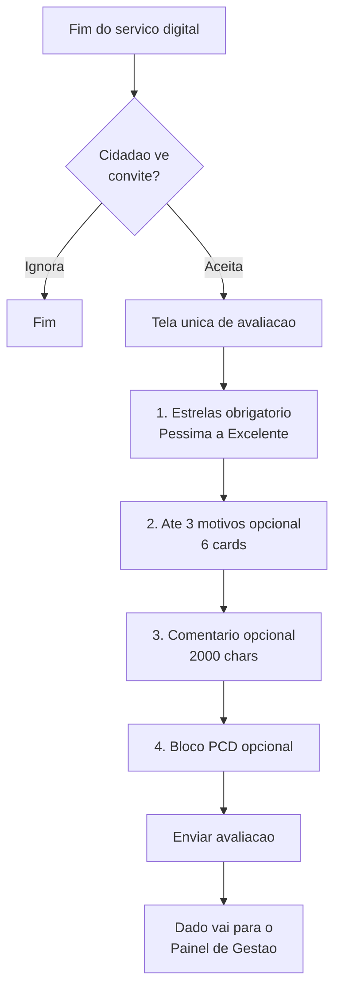

# Ferramenta de Avaliação — gov.br

> Peça operacional do modelo federal. O guarda-chuva estratégico é tratado em [central-de-qualidade.md](./central-de-qualidade.md).

## O que é

`[FATO]` A Ferramenta de Avaliação é a solução técnica que executa, na prática, a Avaliação de Satisfação dos Usuários dos serviços públicos digitais federais. É descrita como *"solução pronta e integrada ao GOV.BR, que permite coletar a opinião dos cidadãos sobre os serviços digitais prestados, de forma simples, segura e padronizada."* Fonte: [Avaliação de Satisfação do Usuário — LabQ](https://www.gov.br/governodigital/pt-br/estrategias-e-governanca-digital/transformacao-digital/central-de-qualidade/labq/avaliacao-de-satisfacao-do-usuario).

`[FATO]` A ferramenta compõe três elementos técnicos:

1. **Componente de UI** exibido ao cidadão dentro do fluxo do serviço.
2. **API de Avaliação** consumida pelos órgãos para gerar links e receber notificações.
3. **Painel de Gestão da Qualidade** para acompanhamento pelo gestor.

## O que o cidadão vê (formulário completo)

### 1. Cabeçalho contextual

`[FATO]` Exibe o rótulo *"Avaliação do Serviço"* seguido do nome do serviço e do órgão responsável. Exemplo real (`image.png`): *"Realizar a Assinatura Eletrônica de documentos — Ministério da Gestão e da Inovação em Serviços Públicos (MGI)"*.

### 2. Pergunta principal + estrelas

`[FATO]` Enunciado: **"Como foi a sua experiência com o serviço?"**

`[FATO]` Escala de 5 estrelas com rótulos textuais fixos:

| Estrelas | Rótulo |
|---|---|
| 1 | Péssima |
| 2 | Ruim |
| 3 | Mais ou menos |
| 4 | Boa |
| 5 | Excelente |

Fonte: página LabQ; corroborado pela tela oficial (`image.png`).

### 3. Segunda pergunta — motivos positivos (opcional)

`[FATO]` Enunciado: **"O que você mais gostou em nosso serviço? (opcional) — Marque até 3 opções"**. Seis cards clicáveis com ícone:

- Fácil de usar
- Site/aplicativo funcionou bem
- Informações claras
- Consegui resolver
- Foi rápido
- Fácil de encontrar

`[INTERPRETAÇÃO]` A ferramenta captura **motivos positivos**, não termômetro genérico. Isso é uma escolha metodológica: dá à gestão um sinal acionável ("o que funcionou bem?") em vez de forçar o cidadão a dissecar problemas.

### 4. Campo aberto (opcional)

`[FATO]` Enunciado: **"Deixe elogio, sugestão ou crítica (opcional):"** com placeholder *"Para que possamos melhorar o serviço, conte-nos sobre sua experiência."*

`[FATO]` Limite: **2000 caracteres**, com contador regressivo visível ("2000 caracteres restantes"). Fonte: tela oficial (`image copy.png`).

### 5. Bloco acessibilidade (opcional)

`[FATO]` Bloco separado destacado: **"Ajude-nos a melhorar a acessibilidade (opcional)"**.

`[FATO]` Aviso "Saiba mais": *"Para garantir que nossos serviços atendam todas as pessoas, gostaríamos de saber mais sobre você."*

`[FATO]` Pergunta única: **"Você se considera uma pessoa com deficiência?"** com radio Sim/Não.

Fonte: tela oficial (`image copy.png`).

### 6. Botão de envio

`[FATO]` Botão **"Enviar avaliação"** em azul, único CTA da tela.

### 7. Anonimato

`[FATO]` O formulário **não solicita CPF, nome, e-mail ou qualquer identificação obrigatória**. A avaliação é anônima por design — decisão explícita da SGD que reduz atrito e minimiza superfície de dados pessoais (aderência à LGPD).

## Fluxo do cidadão

`[FATO]` Momento típico: após conclusão do serviço. O órgão pode:

- Gerar **link direto** de avaliação via API ao encerrar o atendimento; ou
- Deixar o **componente permanentemente disponível** na página do serviço no gov.br.

## Como o órgão integra (API)

`[FATO]` Gestores solicitam **credenciais de integração** para usar a API de Avaliação via formulário na plataforma de solicitação da SGD. Fonte: página LabQ.

`[HIPÓTESE]` A API pública documentada em `manual-avaliacao.servicos.gov.br` cobre: geração de link de avaliação, recebimento de resultados, consulta de notas agregadas. **Não identificado** SLA ou throttling oficial nesta pesquisa.

`[FATO]` Contato de apoio: `labq@gestao.gov.br`.

## O que o gestor vê (Painel de Gestão)

`[FATO]` **Painel de Gestão da Qualidade de Serviços Digitais** — acesso restrito a gestores e editores cadastrados. Consolida:

- Notas médias por serviço e por período.
- Distribuição de estrelas (histograma).
- Frequência dos 6 motivos positivos escolhidos.
- Comentários abertos (moderados).
- Encaminhamentos personalizados para melhoria.

`[FATO]` Além do painel restrito, três visualizações **públicas**:

1. **Página do serviço no gov.br** — nota média e nº de avaliações à vista do próximo cidadão.
2. **Painel de Monitoramento de Serviços Federais** — visão consolidada federal.
3. **Ranking de Serviços e de Órgãos** — comparação pública entre unidades.

## Cálculo do índice de satisfação

`[HIPÓTESE]` Média aritmética simples das notas por serviço, publicada como "nota de 1 a 5" (ex.: 4,39). **Não identificada** fórmula ponderada oficial (por recência, por volume, por dimensão) na documentação pública consultada.

`[INTERPRETAÇÃO]` Um MS que replique deve decidir se aplica ponderação (útil se houver risco de manipulação por poucos avaliadores) ou mantém média simples (mais transparente e defensável publicamente).

## Base legal (dispositivos que amarram o formulário)

Da **Portaria SGD/ME 548/2022** (marco anterior, ainda muito citado):

- **Art. 7º, § 1º:** *"O nível de satisfação será indicado pelo usuário em escala de cinco pontos."*
- **Art. 7º, § 3º:** *"A avaliação de satisfação não poderá ser uma etapa obrigatória da jornada do usuário."* — princípio fundamental: **avaliação nunca bloqueia serviço**.
- **Art. 8º:** *"As unidades gestoras deverão utilizar a ferramenta de avaliação disponibilizada pela Secretaria de Governo Digital."*
- **Art. 12:** *"A Secretaria de Governo Digital calculará e divulgará as notas médias de satisfação dos usuários por serviço, por órgão ou entidade e global, com periodicidade mensal."*
- **Art. 13, parágrafo único:** ranking classificatório por proporção de serviços integrados.

Fonte: [Portaria 548/2022 — Legislação Contábil (transcrição)](https://legislacao.contabil.business/1643134772). A norma **vigente** é a [Portaria SGD/MGI 1083/2025](https://bibliotecadigital.gestao.gov.br/handle/123456789/533149), que revisou e aprimorou esses dispositivos.

## Adoção por estados e municípios

`[HIPÓTESE]` A Portaria 1083/2025 disciplina o **Executivo Federal**. **Não identificado** procedimento formal público de adesão de entes subnacionais à ferramenta federal.

`[RECOMENDAÇÃO]` Para o MS, dois caminhos:

1. **Replicar o modelo em plataforma própria** (menor risco de dependência; controle total).
2. **Conversar diretamente com a SGD** para explorar cooperação/uso da API — caminho promissor mas depende de acordo institucional.

## Confirmações vs. imagens de referência

Todos os elementos da tela oficial anexada (`image.png` + `image copy.png`) foram **confirmados pela documentação pública**. Nenhum desvio identificado.

## Fontes

- Ferramenta de Avaliação (página institucional) — https://www.gov.br/governodigital/pt-br/plataformas-e-servicos-digitais/ferramenta-de-avaliacao
- Avaliação de Satisfação (LabQ) — https://www.gov.br/governodigital/pt-br/estrategias-e-governanca-digital/transformacao-digital/central-de-qualidade/labq/avaliacao-de-satisfacao-do-usuario
- Portaria SGD/ME 548/2022 (transcrição) — https://legislacao.contabil.business/1643134772
- Portaria SGD/MGI 1083/2025 (Biblioteca Digital) — https://bibliotecadigital.gestao.gov.br/handle/123456789/533149
- Manual API de Avaliação — https://manual-avaliacao.servicos.gov.br/pt-br/latest/faq.html
