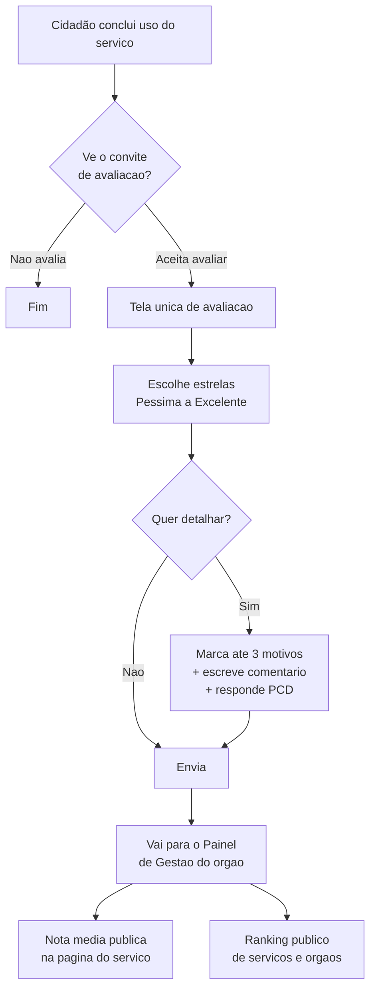

# Referência principal — gov.br

> **Por decisão da chefia da equipe, o gov.br é a referência primária deste estudo.** Cases de mercado (iFood, Uber, Airbnb, Google, Amazon, GOV.UK) permanecem como referências secundárias — servem para calibrar, não para substituir.

## Por que gov.br é a referência

`[FATO]` gov.br é o **portal único de serviços do Governo Federal**, mantido pela Secretaria de Governo Digital (SGD) do Ministério da Gestão e da Inovação em Serviços Públicos (MGI). Reúne mais de mil serviços integrados à ferramenta de avaliação e é o padrão que estados e municípios costumam replicar. Fonte: [Central de Qualidade — Governo Digital](https://www.gov.br/governodigital/pt-br/estrategias-e-governanca-digital/transformacao-digital/central-de-qualidade).

`[FATO]` Indicador atual publicado na página: **1.047 serviços integrados; nota média 4,39/5**. Fonte: mesma página acima.

`[INTERPRETAÇÃO]` Para o Portal de Serviços do MS, adotar (ou pelo menos espelhar) o modelo gov.br entrega três vantagens imediatas: linguagem já reconhecida pelo cidadão, alinhamento com marco normativo federal, e comparabilidade de indicadores com o resto do país.

## Os dois blocos: Central de Qualidade e Ferramenta de Avaliação

O modelo federal se organiza em duas peças complementares:

- **Central de Qualidade** — o "guarda-chuva" estratégico. Reúne boas práticas, metodologias, padrões de qualidade e o painel de gestão. Operada pelo **LabQ (Laboratório de Qualidade de Serviços Públicos do Governo Digital Federal)**. Detalhe em [central-de-qualidade.md](./central-de-qualidade.md).
- **Ferramenta de Avaliação** — a peça operacional. É a caixa de estrelas exibida ao cidadão + API para os órgãos integrarem + painel para os gestores. Detalhe em [ferramenta-de-avaliacao.md](./ferramenta-de-avaliacao.md).

## O modelo em detalhe (validado nas telas oficiais)

As imagens de referência anexadas ao projeto (`image.png` e `image copy.png`) foram cotejadas com a documentação oficial. Confirmações:

### 1. Pergunta principal e escala

`[FATO]` Pergunta: **"Como foi a sua experiência com o serviço?"** Fonte: [Avaliação de Satisfação do Usuário — LabQ](https://www.gov.br/governodigital/pt-br/estrategias-e-governanca-digital/transformacao-digital/central-de-qualidade/labq/avaliacao-de-satisfacao-do-usuario).

`[FATO]` Escala de **5 estrelas com rótulos textuais**:

| Nota | Rótulo oficial |
|---|---|
| 1 | Péssima |
| 2 | Ruim |
| 3 | Mais ou menos |
| 4 | Boa |
| 5 | Excelente |

Fonte: página LabQ acima; corroborado pela tela oficial da avaliação (`image.png`).

### 2. Segunda pergunta — motivos positivos (opcional)

`[FATO]` Enunciado: **"O que você mais gostou em nosso serviço? (opcional) — Marque até 3 opções"**. Seis cards clicáveis:

1. Fácil de usar
2. Site/aplicativo funcionou bem
3. Informações claras
4. Consegui resolver
5. Foi rápido
6. Fácil de encontrar

Fonte: tela oficial (`image.png`); corroborado pela página LabQ.

`[INTERPRETAÇÃO]` O gov.br trata a segunda pergunta como **captura de motivos positivos**, não como termômetro geral. Ela aparece após a nota, é opcional, e limita a 3 escolhas — reduz fadiga e evita que o cidadão marque tudo.

### 3. Campo aberto (opcional)

`[FATO]` Enunciado: **"Deixe elogio, sugestão ou crítica (opcional)"** com placeholder "Para que possamos melhorar o serviço, conte-nos sobre sua experiência." Limite: **2000 caracteres** (contador regressivo visível). Fonte: tela oficial (`image copy.png`).

### 4. Bloco acessibilidade (opcional)

`[FATO]` Bloco separado: **"Ajude-nos a melhorar a acessibilidade (opcional)"**. Pergunta única: **"Você se considera uma pessoa com deficiência?"** com opções Sim/Não. Nota complementar: "Para garantir que nossos serviços atendam todas as pessoas, gostaríamos de saber mais sobre você." Fonte: tela oficial (`image copy.png`).

### 5. Envio

`[FATO]` Botão **"Enviar avaliação"** encerra o fluxo. Fonte: `image copy.png`.

### 6. Anonimato

`[FATO]` A ferramenta foi desenhada para avaliações anônimas. Não há campo obrigatório de CPF ou identificação do cidadão no formulário. Fonte: manual público da API de avaliação.

## Fluxo do cidadão

`[FATO]` Momento típico: após a conclusão do serviço digital. O órgão pode gerar link de avaliação via API ao encerrar o atendimento; alternativamente o widget fica acessível na página do serviço no gov.br. Fonte: documentação da Ferramenta de Avaliação.

## Framework maior: as 7 dimensões de qualidade

`[FATO]` A Central de Qualidade estrutura a qualidade em **7 dimensões** (que se desdobram em **5 atributos cada = 35 padrões**):

1. Facilidade
2. Comunicação
3. Atendimento
4. Experiência unificada
5. Acessibilidade
6. Privacidade e segurança
7. Escuta ativa

Fonte: [Padrões de Qualidade para Serviços Públicos Digitais](https://www.gov.br/governodigital/pt-br/estrategias-e-governanca-digital/transformacao-digital/central-de-qualidade/padroes-de-qualidade).

`[INTERPRETAÇÃO]` Essas dimensões alimentam o **Autodiagnóstico de Maturidade** (uso interno pelo gestor) — não são as mesmas opções apresentadas ao cidadão na tela. O cidadão vê 6 cards de motivos positivos; o gestor trabalha com 7 dimensões e plano de ação. São camadas distintas do mesmo modelo.

## Base legal

- **Lei 13.460/2017** — Código de Defesa do Usuário de Serviços Públicos. Art. 23 obriga órgãos a avaliar continuamente satisfação, qualidade do atendimento, cumprimento de prazos, quantidade de manifestações e medidas adotadas. Resultado publicado no sítio do órgão.
- **Decreto 9.094/2017** — Carta de Serviços ao Usuário e ferramenta de pesquisa de satisfação.
- **Portaria SGD/ME nº 548, de 24/01/2022** — instituiu o Modelo de Qualidade dos Serviços Públicos federais (Art. 7º: escala de 5 pontos; Art. 8º: obrigatoriedade de integração; Art. 12: divulgação mensal de notas médias; Art. 13: ranking). Fonte: [Portaria SGD/ME 548/2022 (Diário Oficial)](https://www.in.gov.br/en/web/dou/-/portaria-sgd/me-n-548-de-24-de-janeiro-de-2022-375784151).
- **Portaria SGD/MGI nº 1.083, de 14/02/2025** — revisou e aprimorou o marco anterior: dispõe sobre avaliação de satisfação, padrões de qualidade (7 dimensões × 5 atributos), Nível de Maturidade Digital e autodiagnóstico. Fonte: [Biblioteca Digital MGI — Portaria 1083/2025](https://bibliotecadigital.gestao.gov.br/handle/123456789/533149).
- **Lei 13.709/2018 (LGPD)** — tratamento de dados sob execução de política pública (art. 7º VII); ferramenta trabalha anonimizada por padrão.

`[FATO]` A Portaria 1083/2025 é a norma **vigente e atual**. A 548/2022 permanece histórica e ainda é a mais citada em materiais anteriores a 2025.

## O que a gestão faz com os dados

`[FATO]` A ferramenta entrega três camadas de visualização:

- **Página pública do serviço no gov.br** — média e nº de avaliações à vista do próximo cidadão.
- **Painel de Monitoramento de Serviços Federais** — visão consolidada federal (público).
- **Painel de Gestão da Qualidade de Serviços Digitais** — visão detalhada por serviço e órgão (restrito a gestores e editores cadastrados). Reúne "dados e encaminhamentos personalizados que possibilitam a evolução contínua dos serviços prestados". Fonte: Central de Qualidade.

`[FATO]` Existe **Ranking de Serviços e de Órgãos** — cria pressão comparativa saudável entre unidades. Fonte: mesma.

`[FATO]` Ciclo de melhoria vinculado: as dimensões pior avaliadas alimentam o **Autodiagnóstico** e plano de ação por serviço. Contato de apoio ao gestor: `labq@gestao.gov.br`.

## Aplicabilidade ao Mato Grosso do Sul

`[HIPÓTESE]` Três caminhos possíveis, do mais leve ao mais estruturante:

1. **Replicar o modelo** (recomendado como ponto de partida). O MS constrói sua própria ferramenta espelhando pergunta, escala, cards e campo aberto do gov.br. Vantagem: cidadão não precisa reaprender; comparabilidade natural com indicadores federais; independência técnica. Custo: precisa de painel próprio e política de moderação.
2. **Integrar com a API federal**. Serviços do MS que já estão catalogados no gov.br poderiam usar a mesma API de avaliação. Vantagem: reuso de infraestrutura pronta. Custo: `[HIPÓTESE]` depende de negociação com SGD; não há evidência pública de modo "self-service para estados" na Portaria 1083/2025 — a norma foca o Executivo Federal. **Não identificado** processo formal para adesão de entes subnacionais.
3. **Modelo híbrido**. Avaliação nativa no Portal MS, com contrato de exportação para o painel federal quando o serviço também aparecer no gov.br.

`[RECOMENDAÇÃO]` Começar pelo caminho 1 (replicar) e manter conversa aberta com a SGD para viabilizar o caminho 2 em uma segunda etapa.

## Confirmações e desvios em relação às imagens de referência

| Elemento | Imagens de referência | Documentação oficial | Situação |
|---|---|---|---|
| Pergunta principal | "Como foi a sua experiência com o serviço?" | Confirmado (LabQ) | OK |
| Escala 5 estrelas | Péssima / Ruim / Mais ou menos / Boa / Excelente | Confirmado (LabQ) | OK |
| Segunda pergunta | "O que você mais gostou em nosso serviço?" — 6 cards, até 3 | Confirmado (LabQ) | OK |
| Campo aberto | "Deixe elogio, sugestão ou crítica" — 2000 caracteres | Rótulo confirmado; limite visto apenas na tela | OK (limite via tela) |
| Bloco acessibilidade | "Você se considera uma pessoa com deficiência?" Sim/Não | **Não identificado** em página LabQ isolada; confirmado apenas por tela oficial | Aceito (evidência primária: captura oficial) |
| Botão | "Enviar avaliação" | Confirmado (tela) | OK |

`[INTERPRETAÇÃO]` A documentação institucional descreve o **modelo** mas não sempre lista **cada campo do formulário**. A tela real do serviço é a fonte mais fiel para o layout final — e ela bate com o que a equipe já mapeou.

## Recomendações para a próxima etapa (proposta do MS)

`[RECOMENDAÇÃO]`

1. Adotar **integralmente pergunta, escala e rótulos** do gov.br. Sem reinvenção.
2. Manter os **6 cards de motivos positivos** — funcionam como taxonomia leve; permitem análise agregada sem obrigar campo aberto.
3. Manter **campo aberto opcional com limite de 2000 caracteres**.
4. Considerar o **bloco de acessibilidade** como diferencial de política pública — MS pode ampliá-lo (ex.: tipo de deficiência, uso de tecnologia assistiva) desde que mantenha opcionalidade e transparência LGPD.
5. Publicar **nota média na página do serviço** (Lei 13.460 art. 23 §2º) e **ranking interno** para gestão.
6. Definir **momento único de convite** — ao final do serviço, uma vez, sem repetir na mesma sessão.
7. Anonimato por default; login opcional apenas se agregar valor claro à gestão (ex.: permitir resposta do órgão).

## Lacunas de pesquisa

- **Não identificado** procedimento formal para estados/municípios usarem a API federal de avaliação.
- **Não identificado** texto integral da Portaria 1083/2025 acessível via WebFetch (Biblioteca Digital MGI retornou 403). Requer download manual para citação artigo a artigo.
- **Não identificado** documentação pública do dsgov com componente pronto de "avaliação de satisfação" reutilizável.
- `[HIPÓTESE]` A fórmula do índice de satisfação parece ser média aritmética simples das notas por serviço; não localizada fórmula ponderada oficial.

## Fontes

Consolidadas em [pesquisa/fontes.md — seção Benchmark gov.br](../../pesquisa/fontes.md#benchmark--governo-digital-govbr--foco-principal).
