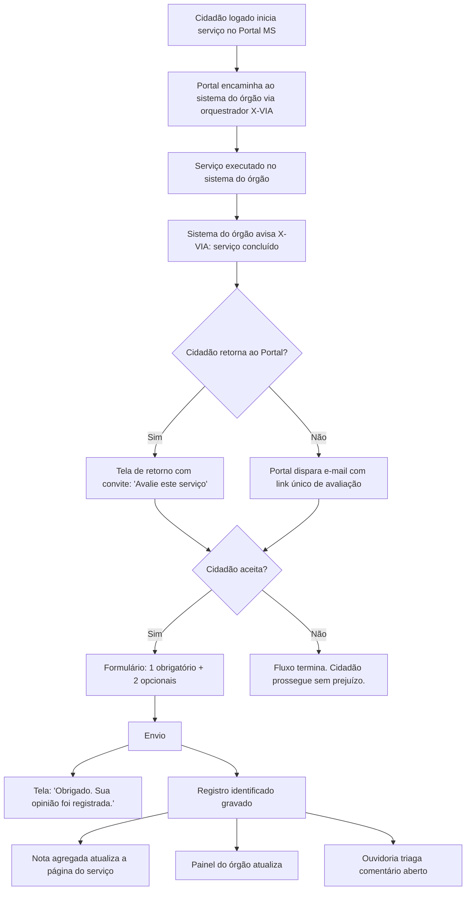
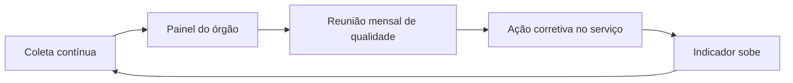

# 3. Modelo proposto

> Se o Portal ligar a avaliação amanhã, é isso. Documento principal do estudo.

## Resumo em uma tela

| Item | Definição |
|---|---|
| Pergunta | *"Como foi a sua experiência com o serviço?"* |
| Escala | 5 estrelas rotuladas — Péssima / Ruim / Mais ou menos / Boa / Excelente |
| Perguntas opcionais | Motivos positivos (6 cards, marca até 3) · comentário aberto (2000 caracteres) |
| Fora da primeira versão | Autodeclaração PcD — bloco previsto no padrão gov.br, adiado (ver Bloco 4) |
| Momento | Ao concluir o serviço: convite na tela do Portal **e** e-mail. **Nunca bloqueia.** |
| Reavaliação | O mesmo cidadão só avalia o mesmo serviço de novo depois de **10 dias** |
| Identificação | Cidadão logado no Portal MS. Registram-se id do usuário e município do serviço finalístico. **Nenhum campo novo de identificação no formulário.** |
| Indicador principal | Nota média (1–5) + % Satisfeitos (nota 4 e 5) |

## Escopo — decisão SGD 2026-08-25

Duas decisões da Superintendência de Governo Digital estreitam o escopo original:

1. **Somente serviços que nascem no orquestrador X-VIA.** Serviços legados fora do orquestrador ficam de fora nesta onda. Sem X-VIA, o Portal não tem sinal confiável de conclusão do serviço nem de quem o executou.
2. **Avaliação identificada.** O cidadão está logado no Portal para acessar o serviço via X-VIA — a avaliação usa a mesma sessão e registra `id_usuario` (identificador do IdP gov.br) e município do serviço finalístico. Base legal LGPD deixa de se apoiar em anonimato e passa a se apoiar em **execução de política pública** (art. 7º, III + art. 11, II, "b" para dado sensível). Ver [Dados e privacidade](04-dados-e-privacidade.md).

## As perguntas do formulário

### Bloco 1 — Nota (única obrigatória)

**Enunciado:** *"Como foi a sua experiência com o serviço?"*

**Formato:** 5 estrelas rotuladas.

| Estrelas | Rótulo |
|---|---|
| 1 | Péssima |
| 2 | Ruim |
| 3 | Mais ou menos |
| 4 | Boa |
| 5 | Excelente |

**Justificativa da escala:** ímpar (permite ponto neutro), rotulada (elimina ambiguidade cultural do "3 é bom ou ruim?"), visual (estrelas comunicam rapidamente para público heterogêneo), aderente ao padrão gov.br (Portaria SGD/ME nº 548/2022, art. 7º, §1º prevê "escala de cinco pontos").

**Tempo estimado:** cerca de 5 segundos.

### Bloco 2 — Motivos positivos (opcional)

**Enunciado:** *"O que você mais gostou em nosso serviço? — Marque até 3 opções"*

**Formato:** 6 cards clicáveis, seleção múltipla até 3, ordem fixa:

1. Fácil de usar
2. Site/aplicativo funcionou bem
3. Informações claras
4. Consegui resolver
5. Foi rápido
6. Fácil de encontrar

`[INTERPRETAÇÃO]` Foco em positivo (não em problemas) é escolha metodológica deliberada do gov.br: reduz frustração do cidadão que teve má experiência e dá à gestão sinal acionável sobre o que preservar.

### Bloco 3 — Comentário aberto (opcional)

**Enunciado:** *"Deixe elogio, sugestão ou crítica"*

**Placeholder:** *"Para que possamos melhorar o serviço, conte-nos sobre sua experiência."*

**Formato:** área de texto, limite de **2000 caracteres**, contador visível.

**Moderação:** o texto passa por triagem antes de qualquer uso. Detalhes em [Dados e privacidade](04-dados-e-privacidade.md).

### Bloco 4 — Autodeclaração PcD (fora da primeira versão)

`[RECOMENDAÇÃO]` **Decisão de 2026-09-02: o bloco não entra na primeira versão do formulário.**

O padrão gov.br prevê o bloco de acessibilidade — *"Você se considera uma pessoa com deficiência?"*, Sim / Não, em área visualmente separada. Esta é, portanto, uma **divergência consciente do modelo âncora**, e a justificativa é a seguinte:

1. **Não há uso definido para o dado na primeira versão.** O recorte de acessibilidade depende de painel e leitura de resultados, que pertencem à etapa seguinte do projeto. Coletar antes de existir quem leia contraria a regra do próprio estudo: o uso do dado precisa estar declarado antes de o campo ser criado.
2. **Minimização (LGPD art. 6º, III).** Deficiência é dado pessoal sensível (art. 5º, II). Sem finalidade ativa, a coleta é excesso.
3. **Simplifica o go-live.** Sem dado sensível, a primeira versão dispensa a base legal do art. 11, II, "b", reduz o escopo do Relatório de Impacto à Proteção de Dados e elimina o prazo de retenção diferenciado.

**Quando volta:** junto com o painel de resultados, quando existir destino declarado para o recorte de acessibilidade — responsável pela leitura, indicador definido e ação prevista a partir do resultado. O texto, o formato e a base legal já estão prontos acima para reuso, sem retrabalho.

`[INTERPRETAÇÃO]` Adiar não é abandonar. O bloco é o único ponto do formulário que enxerga desigualdade de acesso; entrar sem leitor apenas produziria dado parado.

### Botão de envio

**Rótulo:** *"Enviar avaliação"*. Habilita assim que a nota é escolhida.

### Cabeçalho contextual

**Formato:** *"Avaliação do Serviço — {Nome do Serviço} — {Órgão}"*

**Exemplo:** *"Avaliação do Serviço — Emissão de 2ª via de IPVA — Secretaria de Estado de Fazenda"*

Reduz a chance de nota mal atribuída ao serviço errado.

## Ordem, tempo e impacto na conclusão do formulário

| # | Bloco | Obrigatório | Tempo estimado | Drop-off esperado |
|---|---|---|---|---|
| 1 | Nota (5 estrelas) | Sim | ~5s | Baixo |
| 2 | Motivos positivos | Não | ~10s | Nulo |
| 3 | Comentário aberto | Não | 0–60s | Nulo |
| — | Botão enviar | — | ~1s | — |
| 4 | ~~Autodeclaração PcD~~ | Fora da primeira versão | — | — |

`[FATO]` Microsurveys de 2–3 perguntas atingem 86,8% de conclusão; formulários de 4–6 perguntas caem para 77,4% (Survicate 2025). O modelo do gov.br tem 1 pergunta obrigatória + 3 opcionais; a primeira versão do MS entra com **1 obrigatória + 2 opcionais** — cidadão apressado envia em 5 segundos; interessado gasta até 80 segundos. Isso preserva a conclusão sem sacrificar profundidade.

`[HIPÓTESE]` Meta de taxa de resposta esperada para o Portal MS: **entre 5% e 15% dos usuários únicos** que concluem serviço, alinhada ao intervalo típico de instrumentos de satisfação em governo digital. **Não identificada** taxa oficial pública do gov.br para calibração precisa.

## Caminho percorrido pelo cidadão

### Como o cidadão volta ao formulário — proposta prévia SGD

`[RECOMENDAÇÃO]` Quando o cidadão sai do Portal para o sistema do órgão finalístico e não retorna, o Portal dispara **e-mail transacional com link único** para a página de avaliação. Regras:

1. O sistema do órgão avisa o orquestrador X-VIA que o serviço terminou.
2. O Portal dispara o e-mail em janela curta (5–60 minutos) para preservar a recência da experiência.
3. Link assinado, com validade limitada e uso único.
4. **O e-mail sai sempre**, inclusive para quem já avaliou na tela do Portal (decisão D14, 2026-09-02). Muda o conteúdo, não o envio: quem já avaliou recebe agradecimento, sem link de avaliação; quem não avaliou recebe o convite com o link.

**Pendência técnica:** o sinal de conclusão do serviço vem do sistema do órgão para o X-VIA. **Não identificado** se todos os sistemas finalísticos publicam esse evento com padrão único. Precisa ser confirmado com o time do X-VIA antes de estimar prazo.

**Alternativa considerada e descartada como caminho principal:** tela de retorno ao Portal ao final do serviço no sistema do órgão. Descartada porque exige que cada sistema do órgão implemente a chamada de volta — custo distribuído, prazo imprevisível. E-mail centraliza a orquestração no Portal.

## Regras críticas do fluxo

1. **Um convite por execução, nos dois canais.** A tela do Portal convida ao concluir o serviço e o e-mail sai em seguida, sempre. Não há retry nem lembrete: cada execução gera exatamente um convite em tela e um e-mail, e o e-mail de quem já avaliou é de agradecimento, não de cobrança.
1-A. **Reavaliação só depois de 10 dias.** O mesmo cidadão só pode avaliar o mesmo serviço novamente após 10 dias da última avaliação. Dentro desse prazo, o convite em tela não aparece e o e-mail sai sem link de avaliação. Prazo parametrizável, com 10 dias como padrão.
2. **Nunca bloquear.** Fechar/pular sempre disponível. Cumpre art. 7º, §3º da Portaria SGD/ME nº 548/2022.
3. **Identificação vem do login.** Cidadão já está logado no Portal para acessar o serviço via X-VIA — a avaliação usa a mesma sessão. **Nenhum campo novo de identificação é solicitado no formulário.**
4. **Prevenção de duplicidade.** Chave `id_usuario + id_execucao_orquestrador` impede múltiplas avaliações da mesma execução.
5. **Moderação do comentário aberto** antes de qualquer publicação. Nota agregada não depende de moderação.
6. **Tempo de resposta da API < 500 ms no p95.** Cidadão nunca espera para enviar.
7. **Publicação sempre agregada.** A identificação existe no dado bruto para uso interno (retorno, análise, ouvidoria). O painel público e os dados abertos só mostram agregados — ver [Dados e privacidade](04-dados-e-privacidade.md).

## O que replica o gov.br, o que difere e por quê

### Replica integralmente

- Pergunta, escala e rótulos.
- 6 cards de motivos positivos.
- Comentário aberto opcional, 2000 caracteres.
- Bloco de acessibilidade opcional.
- Momento do convite (ao concluir o serviço) e a regra de nunca bloquear.

### Difere (com justificativa)

| Item | gov.br | MS proposto | Motivo |
|---|---|---|---|
| Plataforma | Ferramenta central SGD/MGI | Instrumento próprio do Portal MS | Adesão federal para entes subnacionais não formalizada. Replica-se o modelo. |
| Identificação | Anônima por design | **Identificada** — usuário logado + município do serviço finalístico | Decisão SGD 2026-08-25. Permite retorno ao cidadão, análise por perfil/localização e integração com histórico do Portal. Base LGPD: execução de política pública. |
| Escopo | Todo serviço federal integrado | Apenas serviços que nascem no orquestrador X-VIA | Sem orquestrador não há sinal confiável de conclusão. |
| Canal do convite | Um convite por execução, em um canal só | Convite na tela **e** e-mail, sempre | Decisão D14 (2026-09-02). O e-mail garante alcance de quem sai do Portal e não volta; quem já avaliou recebe agradecimento, não novo pedido. O limite ao excesso passa a ser a regra dos 10 dias. |
| Reavaliação | Uma avaliação por execução do serviço | Uma por execução **e** intervalo mínimo de 10 dias para o mesmo serviço | Decisão D14. Impede que execuções seguidas do mesmo serviço virem sequência de pedidos de avaliação ao mesmo cidadão. |
| Publicação | Painel Central de Qualidade + dados.gov.br | Painel MS + `dados.ms.gov.br` (fase 2) | Início com painel próprio; explorar conexão com federal em fase 2. |

## Extensibilidade do formulário

O formulário **não é fixo**. A composição de campos é parametrizável — a gestão pode incluir, remover, reordenar ou reetiquetar campos sem alteração de código, seguindo o mesmo princípio já adotado na carta de serviço.

Os campos acima são o **núcleo inicial**: ponto de partida com que o instrumento entra no ar, herdado do modelo federal.

**Regras que qualquer campo novo deve respeitar:**

1. **Opcional sempre.** A nota permanece o único campo obrigatório.
2. **Sem coleta de dado pessoal novo no formulário.** A identificação já vem do login; nenhum campo novo pode pedir CPF, nome, telefone, endereço ou repetir dado disponível.
3. **Uso declarado antes da criação.** Todo campo precisa ter, no ato da criação, um indicador ou decisão de gestão que ele alimenta. Campo sem uso definido não entra.
4. **Dado sensível exige parecer prévio do Encarregado (DPO).**
5. **Custo cognitivo é orçamento fechado.** Recomendação: no máximo 6 campos visíveis simultaneamente.
6. **Aditivo, nunca destrutivo.** Alterar semântica de um campo do núcleo (mudar escala, rótulos ou texto da pergunta 1) **quebra a série histórica e a comparabilidade com o gov.br**. Se necessário, trata-se de campo novo, não da edição do existente.
7. **Versionamento obrigatório.** Toda alteração gera nova `versao_formulario`, gravada em cada avaliação.
8. **Avaliações antigas não são reescritas.** Campo removido preserva dados coletados; campo adicionado nasce vazio para o histórico.

## Fluxo de melhoria contínua

## Referências

- [Referência adotada](02-referencia.md)
- [Dados e privacidade](04-dados-e-privacidade.md)
- [Indicadores](05-indicadores.md)
- Fontes em [`pesquisa/fontes.md`](pesquisa/fontes.md)
