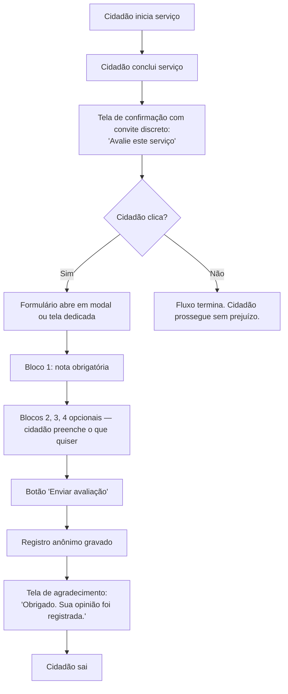
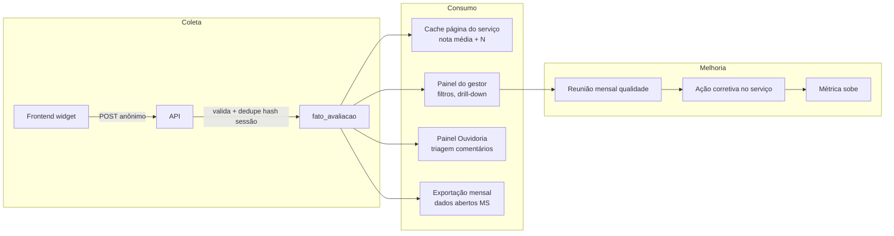

# Fluxo da avaliação

## Fluxo do cidadão

## Fluxo do dado

## Regras críticas do fluxo

1. **Convite único.** Um serviço concluído = um convite. Sem retry, sem lembrete.
2. **Nunca bloquear.** Fechar/pular sempre disponível. Cumpre art. 7º §3º Portaria 548/2022.
3. **Anônimo.** Nenhum passo do fluxo requer identificação.
4. **Dedupe.** Hash de sessão evita spam mas não identifica cidadão.
5. **Moderação.** Comentário aberto passa por moderação antes de publicação (se publicado). Nota agregada não depende de moderação.
6. **Tempo de resposta da API < 500ms.** Cidadão nunca deve esperar para enviar.

## Onde a avaliação é exibida

| Local | O que aparece | Público |
|---|---|---|
| Página do serviço | Nota média + N + link "ver avaliações" | Cidadão |
| Painel do gestor | Distribuição, comentários, série temporal | Gestor do órgão |
| Painel Ouvidoria | Comentários abertos + tags críticas | Ouvidoria |
| Painel SETDIG | Ranking geral, alertas | Direção SETDIG |
| dados.ms.gov.br | Agregado mensal em CSV | Público geral (fase 2) |

## Cadência

| Ritmo | Ação |
|---|---|
| Tempo real | Coleta + atualização de nota média (com cache curto) |
| Diário | Ouvidoria triaga comentários novos |
| Semanal | Painel gestor gera relatório automático |
| Mensal | Reunião de qualidade por órgão |
| Trimestral | Revisão SETDIG do ranking geral |
| Anual | Publicação de série histórica em dados abertos |
