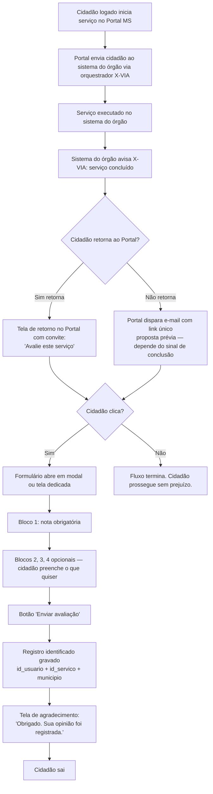
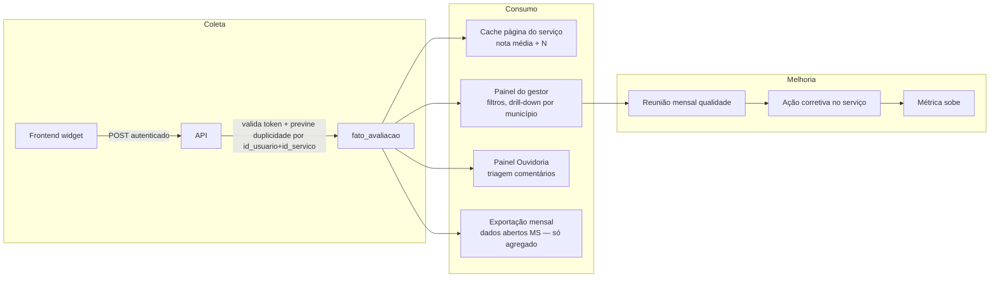

# Fluxo da avaliação

> Escopo desde 2026-08-25 (SGD): apenas serviços que nascem no orquestrador X-VIA. Avaliação identificada — cidadão logado no Portal MS. Base LGPD: execução de política pública (art. 7º III + art. 11 II "b"). Ver [LGPD](../04-cidadao/lgpd.md).

## Fluxo do cidadão

## Retorno por e-mail (proposta prévia)

`[RECOMENDAÇÃO]` **Proposta prévia da SGD (2026-08-25):** quando o cidadão clica em *Acessar serviço* no Portal MS, ele sai do Portal e conclui o serviço no sistema do órgão finalístico. Sem caminho de retorno, ele não avalia. Solução proposta:

1. O sistema do órgão avisa o orquestrador X-VIA que o serviço terminou.
2. O Portal dispara **e-mail transacional** para o cidadão logado, com **link único** para a página de avaliação daquele serviço específico.
3. Link é assinado (token curto, validade limitada) para vincular a avaliação ao serviço correto e evitar reuso.

**Dependência técnica em aberto:** o sinal de conclusão do serviço vem do sistema do órgão para o X-VIA. Hoje **não identificado** se todos os sistemas finalísticos publicam esse evento com padrão único. Precisa ser confirmado com **Maycon** antes de estimar prazo.

**Alternativa considerada:** tela de retorno ao Portal ao final do serviço no sistema do órgão. Fica descartada como caminho principal porque exige que cada sistema do órgão implemente a chamada de volta — custo distribuído, prazo imprevisível. E-mail centraliza a orquestração no Portal.

`[HIPÓTESE]` Envio de e-mail deve ocorrer em janela curta (5–60 min) após a conclusão, para preservar a recência da experiência do cidadão. Ajustar após piloto.

**Pendências desta proposta:**

- Confirmar com Maycon como o sistema do órgão sinaliza conclusão do serviço.
- Definir padrão do evento de conclusão que o X-VIA vai consumir.
- Definir política do link único: validade, número máximo de reenvios, comportamento se cidadão avaliar via tela de retorno antes do e-mail chegar.
- Definir opt-out específico deste e-mail (não confundir com opt-out geral do Portal).

## Fluxo do dado

## Regras críticas do fluxo

1. **Convite único.** Um serviço concluído = um convite (tela de retorno **ou** e-mail, não os dois). Sem retry, sem lembrete.
2. **Nunca bloquear.** Fechar/pular sempre disponível. Cumpre art. 7º §3º Portaria 548/2022.
3. **Identificação vem do login.** Cidadão já está logado no Portal para acessar o serviço via X-VIA — a avaliação usa a mesma sessão. Nenhum campo novo de identificação é solicitado no formulário.
4. **Prevenção de duplicidade.** Chave `id_usuario + id_servico + janela` impede múltiplas avaliações da mesma execução do serviço.
5. **Moderação.** Comentário aberto passa por moderação antes de publicação (se publicado). Nota agregada não depende de moderação.
6. **Tempo de resposta da API < 500ms.** Cidadão nunca deve esperar para enviar.
7. **Publicação sempre agregada.** A identificação existe no dado bruto para uso interno (retorno, análise, ouvidoria). O painel público e os dados abertos só mostram agregados (ver [LGPD](../04-cidadao/lgpd.md) e [Indicadores](indicadores.md)).

## Onde a avaliação é exibida

| Local | O que aparece | Público |
|---|---|---|
| Página do serviço | Nota média + N + link "ver avaliações" | Cidadão |
| Painel do gestor | Distribuição, comentários, série temporal | Gestor do órgão |
| Painel Ouvidoria | Comentários abertos + tags críticas | Ouvidoria |
| Painel SETDIG | Ranking geral, alertas | Direção SETDIG |
| dados.ms.gov.br | Agregado mensal em CSV | Público geral (fase 2) |

## Cadência

| Ritmo | Ação |
|---|---|
| Tempo real | Coleta + atualização de nota média (com cache curto) |
| Diário | Ouvidoria triaga comentários novos |
| Semanal | Painel gestor gera relatório automático |
| Mensal | Reunião de qualidade por órgão |
| Trimestral | Revisão SETDIG do ranking geral |
| Anual | Publicação de série histórica em dados abertos |
