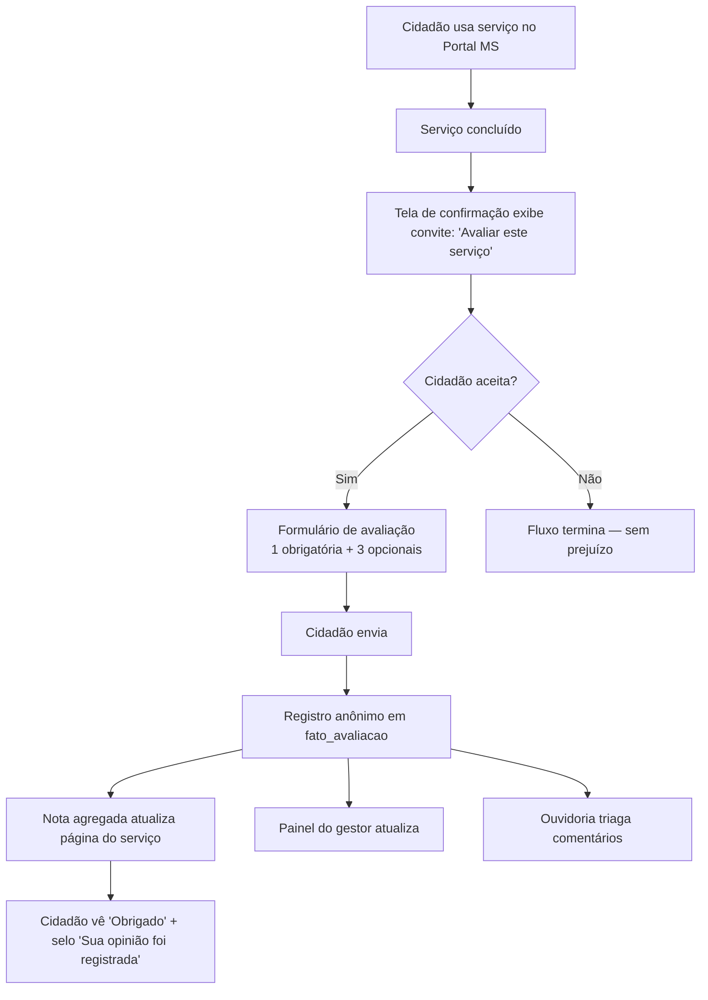
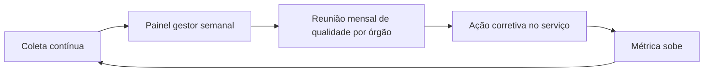

# Modelo proposto para o Portal MS

> Se o Portal ligar a avaliação amanhã, é isso.

## Resumo em uma tela

- **Pergunta:** *"Como foi a sua experiência com o serviço?"*
- **Escala:** 5 estrelas rotuladas — Péssima / Ruim / Mais ou menos / Boa / Excelente.
- **Perguntas 2 e 3 (opcionais):** motivos positivos (6 cards, até 3) + campo aberto (2000 chars).
- **Bloco 4 (opcional):** autodeclaração PcD.
- **Momento:** convite único ao concluir o serviço. **Nunca bloqueia.**
- **Anônimo por default.** Sem CPF, e-mail ou nome.
- **Métrica principal:** nota média (1–5) + % satisfeitos (nota 4+5).

Detalhamento em [Perguntas](perguntas.md), [Escala](escala.md), [Fluxo](fluxo.md), [Indicadores](indicadores.md).

## Justificativa em três frases

1. **Réplica do padrão gov.br** (Portaria SGD/MGI 1.083/2025 e antecessora 548/2022): comparabilidade nacional garantida, custo de decisão baixo, alinhamento com política pública federal.
2. **Menos é mais**: 1 pergunta obrigatória + 3 opcionais. Cidadão apressado envia em ~5 segundos, engajado gasta até 80 segundos.
3. **LGPD e Lei 13.460/2017 atendidas**: anônimo, minimizado, retenção proporcional, obrigatoriedade legal cumprida.

## Como funciona amanhã

## Componentes técnicos (sem entrar em engenharia)

| Peça | O que faz | Onde vive |
|---|---|---|
| Widget de avaliação | Renderiza o formulário no fim do serviço | Frontend Portal MS |
| API de coleta | Recebe POST anônimo, valida, grava | Backend Portal MS |
| Tabela `fato_avaliacao` | Registro imutável de cada avaliação | Banco analítico MS |
| Painel público | Nota média por serviço na página pública | Portal MS |
| Painel do gestor | Detalhamento, filtros, comentários | Restrito a gestor do órgão |
| Painel Ouvidoria | Triagem de comentários abertos | Restrito à Ouvidoria |
| Exportação dados abertos | CSV agregado mensal | dados.ms.gov.br (futuro) |

## O que replica gov.br tal qual

- Pergunta, escala e rótulos.
- 6 cards de motivos positivos.
- Campo aberto opcional, 2000 chars.
- Bloco de acessibilidade opcional.
- Anonimato por default.

## O que difere do gov.br (com justificativa)

| Item | gov.br | MS proposto | Motivo |
|---|---|---|---|
| Plataforma | Ferramenta central SGD/MGI | Widget próprio do Portal MS | Adesão federal para subnacionais não formalizada. Replica-se o modelo. |
| Publicação | Painel Central de Qualidade | Nota na página + painel MS | Início com painel próprio; explorar conexão com federal em fase 2. |
| Exportação | dados.gov.br | dados.ms.gov.br (fase 2) | Depende de maturidade do portal estadual de dados abertos. |

## Alternativas descartadas

Ver [Matriz de decisão](matriz-decisao.md).

## Fluxo de melhoria contínua

## Referências principais

- [Ferramenta de Avaliação — gov.br](../03-benchmark/ferramenta-de-avaliacao.md)
- [Perguntas propostas](../04-cidadao/perguntas.md)
- [LGPD](../04-cidadao/lgpd.md)
- Fontes em [`pesquisa/fontes.md`](../pesquisa/fontes.md)
