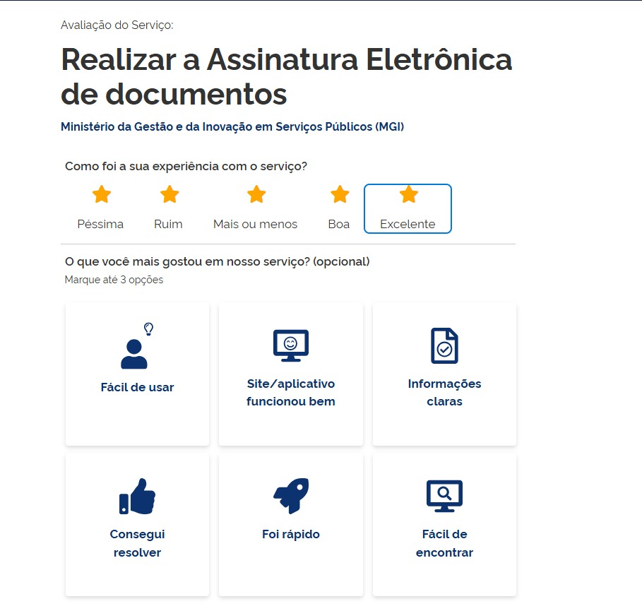
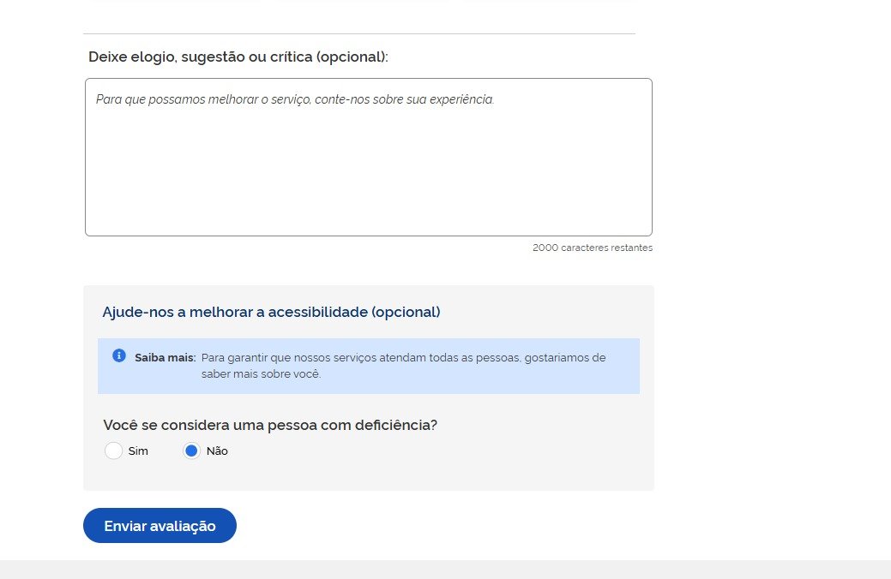

# Avaliação de Serviço — TO BE

**Modelo de coleta, apresentação, triagem e leitura gerencial da avaliação dos serviços do Portal Único do MS.**

Baseado no modelo federal gov.br (Portaria SGD/MGI nº 1.083/2025) e nas regras de negócio consolidadas no estudo [Avaliação dos Serviços — Portal MS](https://fabioramos-02.github.io/avaliacao-de-servicos/).

|                     |                                                     |
| ------------------- | --------------------------------------------------- |
| **Versão**          | v1 — rascunho para validação                        |
| **Área demandante** | Superintendência de Governo Digital (SGD) — SETDIG  |
| **Destinatário**    | Xvia — time de UX e desenvolvimento do Portal Único |
| **Situação**        | Aguardando validação do Analista de Negócios        |

---

## 1. Objetivo

Especificar como o Portal Único do MS deve coletar, apresentar, triar e reportar a avaliação que o cidadão faz dos serviços digitais do Estado.

A **coleta** compreende o formulário que o cidadão preenche ao concluir um serviço; a **apresentação** é como a nota resultante aparece na página pública do serviço; a **triagem** é o tratamento do comentário aberto antes de qualquer uso; os **painéis e indicadores** são a leitura gerencial que sustenta a decisão de melhoria e alimenta o contrato de gestão do Governo do Estado.

O Estado opera **instrumento próprio**, hospedado no Portal Único. O formulário federal do gov.br é a **base inicial** do desenho — ponto de partida já validado em escala nacional, que dá comparabilidade desde o primeiro dia. **Não é uma camisa de força:** o instrumento é do Estado e pode receber novos campos conforme a necessidade da gestão, respeitadas as regras da Seção [3.7](#37-extensibilidade-do-formulario).

**Fora deste pacote:** definição de perfis e permissões de acesso; cessão de dados ao gov.br via API.

---

## 2. Escopos cobertos

| #   | Escopo                           | Seção                                         |
| --- | -------------------------------- | --------------------------------------------- |
| 1   | Coleta da avaliação pelo cidadão | [3](#3-escopo-1-coleta-da-avaliacao)          |
| 2   | Apresentação da nota ao cidadão  | [4](#4-escopo-2-apresentacao-da-nota)         |
| 3   | Triagem do comentário aberto     | [5](#5-escopo-3-triagem-do-comentario-aberto) |
| 4   | Painéis e indicadores            | [6](#6-escopo-4-paineis-e-indicadores)        |

**Não cobertos por este documento:**

- **Perfis e controle de acesso (RBAC).** As seções abaixo indicam _qual área_ consome cada informação, mas a modelagem de perfis e permissões é tratada em etapa própria — ver [Pendência P1](#8-pendencias).
- **Cessão de dados ao gov.br via API.** Documento separado.
- **Avaliação da carta de serviço** ("Esta informação foi útil?" e "Reportar erro"), que já existe em produção e permanece como está — ver [Pendência P5](#8-pendencias).

---

## 3. Escopo 1 — Coleta da avaliação

### 3.1. Ponto de disparo

Ao concluir um serviço, o cidadão vê na tela de confirmação um convite discreto: **"Avalie este serviço"**.

**Regra jurídica que condiciona todo este escopo:** a avaliação **nunca** pode ser etapa obrigatória da jornada (art. 7º, §3º, Portaria SGD/ME nº 548/2022, mantido pela Portaria SGD/MGI nº 1.083/2025). Fechar, pular ou ignorar o convite deve estar sempre disponível, sem prejuízo algum ao serviço.

### 3.2. Cabeçalho do formulário

Texto fixo:

> **Avaliação do Serviço — {Nome do Serviço} — {Órgão}**

### 3.3. Campos do formulário — núcleo inicial

Estes são os campos com que o instrumento entra no ar. Replicam o formulário federal. Único campo obrigatório é a nota; os demais podem ficar em branco sem impedir o envio.

| #   | Campo                                         | Tipo de Campo                                            | Obrigatório | Descrição                                                                                                                                                                                                                           | Exemplo de Preenchimento                                       |
| --- | --------------------------------------------- | -------------------------------------------------------- | ----------- | ----------------------------------------------------------------------------------------------------------------------------------------------------------------------------------------------------------------------------------- | -------------------------------------------------------------- |
| 1   | Como foi a sua experiência com o serviço?     | rating — 5 estrelas com rótulo verbal fixo               | **Sim**     | Nota do cidadão. Rótulos: 1 Péssima, 2 Ruim, 3 Mais ou menos, 4 Boa, 5 Excelente. Valor gravado é o inteiro de 1 a 5.                                                                                                               | 4 — Boa                                                        |
| 2   | O que você mais gostou em nosso serviço?      | checkbox em formato de card — 6 opções, seleção de até 3 | Não         | Motivos positivos. Opções: Fácil de usar; Site/aplicativo funcionou bem; Informações claras; Consegui resolver; Foi rápido; Fácil de encontrar. Gravado como lista de códigos.                                                      | Foi rápido; Consegui resolver                                  |
| 3   | Deixe elogio, sugestão ou crítica             | textarea — limite 2.000 caracteres                       | Não         | Comentário livre. Placeholder: _"Para que possamos melhorar o serviço, conte-nos sobre sua experiência."_ Contador de caracteres restantes visível.                                                                                 | O agendamento foi rápido, mas o e-mail de confirmação demorou. |
| 4   | Você se considera uma pessoa com deficiência? | radio — Sim / Não                                        | Não         | Autodeclaração de PcD. **Dado pessoal sensível** (LGPD art. 5º, II) — bloco visualmente separado dos anteriores, com o aviso: _"Para garantir que nossos serviços atendam todas as pessoas, gostaríamos de saber mais sobre você."_ | Não                                                            |

### 3.4. Metadados gravados junto com a avaliação

Não são preenchidos pelo cidadão nem exibidos na tela. Gravados pelo sistema no momento do envio.

| #   | Campo             | Tipo                | Obrigatório | Descrição                                                                                                                      | Exemplo de Preenchimento  |
| --- | ----------------- | ------------------- | ----------- | ------------------------------------------------------------------------------------------------------------------------------ | ------------------------- |
| 1   | id_servico        | chave técnica       | Sim         | Identificador do serviço avaliado, vinculado ao catálogo do Portal Único.                                                      | 4f2c8e10-…                |
| 2   | id_orgao          | chave técnica       | Sim         | Órgão responsável pelo serviço, derivado do cadastro do serviço.                                                               | Polícia Militar de MS     |
| 3   | canal             | enum — web / mobile | Sim         | Canal pelo qual a avaliação foi enviada.                                                                                       | web                       |
| 4   | data_hora         | datetime ISO-8601   | Sim         | Momento do envio. Base de toda agregação temporal.                                                                             | 2026-08-21T14:32:07-04:00 |
| 5   | hash_sessao       | SHA-256 truncado    | Sim         | Identificador efêmero da sessão, usado **apenas** para deduplicação. Não permite identificar o cidadão. Descartado em 90 dias. | a91f3c…                   |
| 6   | versao_formulario | inteiro             | Sim         | Versão da configuração de campos vigente no momento do envio. Permite comparar séries quando o formulário muda (Seção 3.7).    | 1                         |

### 3.5. Ações da tela

| Ação                     | Quando fica disponível                                                               | Efeito                                                       |
| ------------------------ | ------------------------------------------------------------------------------------ | ------------------------------------------------------------ |
| Enviar avaliação         | Habilita assim que a nota (campo 1) é escolhida. Permanece desabilitado antes disso. | Grava a avaliação e exibe a tela de agradecimento.           |
| Fechar / Pular           | Sempre disponível, em qualquer momento do preenchimento.                             | Encerra o fluxo sem gravar nada. Cidadão segue sem prejuízo. |
| Como tratamos seus dados | Sempre disponível, como link abaixo do botão de envio.                               | Abre o aviso de privacidade em camadas (Seção 3.8).          |

### 3.6. Regras de negócio

1. **Convite único.** Um serviço concluído gera **um** convite. Não há retry, lembrete, pop-up recorrente ou segunda tentativa na mesma sessão.
2. **Nunca bloquear.** Nenhum passo do fluxo pode impedir, atrasar ou condicionar a conclusão do serviço.
3. **Anônimo por design.** Nenhuma etapa exige login, CPF, e-mail, telefone ou nome. Esses campos **não existem** no formulário.
4. **Uma única obrigatoriedade.** A nota é o único campo obrigatório. Nenhum campo adicional pode ser tornado obrigatório (ver Seção 3.7).
5. **Envio parcial é envio válido.** Nota preenchida e demais campos em branco é uma avaliação completa e deve ser gravada normalmente.
6. **Deduplicação.** Uma avaliação por `hash_sessao` + `id_servico`. Tentativa repetida retorna a tela de agradecimento sem gravar novo registro.
7. **Registro imutável.** Avaliação enviada não é editável nem excluível pelo cidadão nem pelo órgão.
8. **Desempenho.** A API de coleta deve responder em menos de 500 ms no p95. O cidadão nunca espera para enviar.
9. **Falha silenciosa.** Se a gravação falhar, o cidadão ainda vê a tela de agradecimento. O erro é logado para o time técnico — nunca exibido como obstáculo ao cidadão.
10. **Tela de agradecimento.** Após o envio: _"Obrigado. Sua opinião foi registrada."_ Sem nova pergunta, sem convite a compartilhar, sem redirecionamento automático.

### 3.7. Extensibilidade do formulário

O formulário **não é fixo**. A composição de campos é parametrizável — a gestão pode incluir, remover, reordenar ou reetiquetar campos sem alteração de código ou deploy, seguindo o mesmo princípio já adotado no cadastro da carta de serviço.

Os campos da Seção 3.3 são o **núcleo inicial**: o ponto de partida com que o instrumento entra no ar, herdado do modelo federal.

**Regras que qualquer campo novo deve respeitar:**

1. **Opcional sempre.** A nota permanece o único campo obrigatório. Nenhum campo adicionado pode bloquear o envio.
2. **Sem dado identificável.** Campo novo não pode pedir nome, CPF, e-mail, telefone, endereço, localização precisa ou qualquer dado que identifique o cidadão, direta ou indiretamente. Isso é limite legal, não preferência de desenho (LGPD art. 6º, III).
3. **Uso declarado antes da criação.** Todo campo precisa ter, no ato da criação, um indicador ou decisão de gestão que ele alimenta. Campo sem uso definido não entra — é coleta sem finalidade.
4. **Dado sensível exige avaliação prévia.** Campo que trate de dado sensível (LGPD art. 5º, II) só entra após parecer do Encarregado (DPO), com bloco visualmente separado e aviso de finalidade, como já ocorre com a autodeclaração de PcD.
5. **Custo cognitivo é orçamento fechado.** Formulário longo derruba a taxa de resposta. Recomendação: no máximo **6 campos visíveis** simultaneamente. Acima disso, avaliar substituir um campo existente em vez de somar mais um.
6. **Aditivo, nunca destrutivo.** Alterar a semântica de um campo do núcleo — mudar a escala, os rótulos ou o texto da pergunta 1 — **quebra a série histórica e a comparabilidade com o gov.br**. Se for realmente necessário, trata-se de um campo novo, não da edição do existente; o antigo é descontinuado e a mudança é registrada como nova `versao_formulario`.
7. **Versionamento obrigatório.** Toda alteração da composição de campos gera nova `versao_formulario`, gravada em cada avaliação (Seção 3.4). Sem isso, não há como saber se uma queda na média veio do serviço ou de uma mudança no formulário.
8. **Avaliações antigas não são reescritas.** Campo removido preserva os dados já coletados; campo adicionado nasce vazio para o histórico.

**Escopo da parametrização** — global, por órgão ou por serviço — e quem tem competência para alterar são pontos ainda em aberto: ver [Pendência P2](#8-pendencias).

### 3.8. Aviso de privacidade no ato

Link **"Como tratamos seus dados"** logo abaixo do botão de envio, abrindo o texto resumido. Conteúdo integral em [LGPD](../04-cidadao/lgpd.md).

Resumo obrigatório na tela:

> **Sua avaliação é anônima.** Não coletamos CPF, e-mail, telefone ou nome. Sua nota e seu comentário são usados para melhorar este serviço. Você pode não avaliar, sem prejuízo ao atendimento.
>
> Base legal: Lei nº 13.709/2018 (LGPD), art. 7º, III e art. 11, II, "b" — execução de política pública prevista na Lei nº 13.460/2017.

O aviso precisa refletir a composição vigente do formulário: incluir um campo novo implica revisar este texto.

## 4. Escopo 2 — Apresentação da nota

### 4.1. Onde aparece

Na página pública do serviço, no cabeçalho, no espaço já previsto como "avaliação" na especificação da carta de serviço (_Carta de Serviço — TO BE v5_, §6.1).

### 4.2. O que aparece

| Elemento                       | Conteúdo                                                | Condição             |
| ------------------------------ | ------------------------------------------------------- | -------------------- |
| Nota média                     | `★ 4,3` — uma casa decimal, arredondamento padrão       | N ≥ 10 no período    |
| Contagem                       | `(1.247 avaliações)`                                    | N ≥ 10 no período    |
| Distribuição em barras         | % em cada uma das 5 notas                               | Opcional, expansível |
| Estado de amostra insuficiente | Texto _"Amostra ainda insuficiente para exibir a nota"_ | N < 10 no período    |

### 4.3. Regras de negócio

1. **Corte mínimo de amostra.** Nota específica só é publicada com no mínimo **10 avaliações** no período. Abaixo disso, exibir o estado de amostra insuficiente — protege contra ranking injusto e contra reidentificação em serviço de baixo volume.
2. **Somente agregado.** Nota individual, comentário individual e qualquer registro bruto **nunca** aparecem na área pública.
3. **Atualização.** Nota média recalculada em tempo real, servida com cache curto. Latência aceitável de alguns minutos entre o envio e a atualização pública.
4. **Fórmulas publicadas:**
   - Nota média = Σ(nota × frequência) ÷ N
   - % Satisfeitos (top-2-box) = (n₄ + n₅) ÷ N × 100
5. **Sem edição.** O órgão não pode ocultar, editar, reordenar ou suprimir a própria nota.
6. **Só o núcleo é publicado.** Campos adicionados via parametrização (Seção 3.7) alimentam painéis internos. Publicá-los na área pública exige decisão explícita.

---

## 5. Escopo 3 — Triagem do comentário aberto

O comentário aberto é o único campo em que o cidadão pode, por iniciativa própria, escrever um dado que o identifique (nome, CPF, telefone, número de protocolo). Por isso passa por triagem antes de qualquer uso.

### 5.1. Estados do comentário

| Estado                 | Significado                                                                      | Quem move                                           |
| ---------------------- | -------------------------------------------------------------------------------- | --------------------------------------------------- |
| Novo                   | Gravado, aguardando triagem. Não visível nos painéis de gestão.                  | Sistema, no envio                                   |
| Triado                 | Revisado, sem dado identificável, liberado para os painéis.                      | Área de triagem                                     |
| Suprimido parcialmente | Dado identificável substituído por `[dado suprimido]`. Liberado para os painéis. | Área de triagem                                     |
| Crítico                | Contém indício de fraude, ilegalidade ou discriminação. Gera alerta imediato.    | Área de triagem, ou sistema por detecção automática |
| Descartado             | Sem conteúdo útil (vazio, spam, texto aleatório). Não entra nos painéis.         | Área de triagem                                     |

A **área de triagem** é a Ouvidoria estadual. A modelagem do acesso correspondente é tratada fora deste documento ([P1](#8-pendencias)).

### 5.2. Regras de negócio

1. **Nota independe de triagem.** A nota média é computada e publicada imediatamente. Só o texto do comentário fica retido até a triagem.
2. **Cadência.** Fila de triagem processada no mínimo uma vez por semana.
3. **Supressão, não exclusão.** Dado identificável é substituído pelo marcador `[dado suprimido]`. O restante do texto é preservado.
4. **Detecção automática como apoio.** O sistema pré-sinaliza padrões de CPF, telefone e e-mail, e palavras-chave críticas (fraude, ilegal, discriminação). A pré-sinalização **sugere**, não decide — a triagem é sempre humana.
5. **Comentário nunca é publicado bruto.** Pode ser citado em relatório interno com trecho e serviço, jamais com identificador.
6. **Rastreabilidade.** Toda ação de triagem registra autor, data/hora e estado anterior.

---

## 6. Escopo 4 — Painéis e indicadores

### 6.1. Visões

Quatro recortes da mesma base. A tabela indica _qual área consome_ cada visão — a tradução disso em perfis e permissões é tratada fora deste documento ([P1](#8-pendencias)).

| Painel            | Quem consome                                      | Conteúdo                                                                                                                                                                                  |
| ----------------- | ------------------------------------------------- | ----------------------------------------------------------------------------------------------------------------------------------------------------------------------------------------- |
| Público           | Cidadão                                           | Nota média, N e distribuição em barras, na página do serviço                                                                                                                              |
| Gestão do serviço | Órgão responsável, restrito aos próprios serviços | Nota média, % satisfeitos e N do mês e do mês anterior; distribuição; ranking dos motivos; últimos 50 comentários triados com filtro por nota; série temporal de 12 meses; alertas ativos |
| Triagem           | Ouvidoria estadual, todos os órgãos               | Fila de triagem; comentários críticos; encaminhamentos abertos por serviço                                                                                                                |
| Consolidado       | SETDIG, todos os órgãos                           | Ranking geral (10 melhores e 10 piores); % de serviços com meta atingida; volume total; serviços em alerta; comparativo por Secretaria                                                    |

### 6.2. Indicadores mínimos — disponíveis no go-live

| #   | Indicador                   | Fórmula                 | Uso                                     |
| --- | --------------------------- | ----------------------- | --------------------------------------- |
| 1   | Nota média                  | Σ(nota) ÷ N             | Número público na página do serviço     |
| 2   | % Satisfeitos               | (n₄ + n₅) ÷ N × 100     | Leitura executiva                       |
| 3   | Distribuição das notas      | %n₁, %n₂, %n₃, %n₄, %n₅ | Diagnóstico — identifica cauda negativa |
| 4   | Nº de avaliações no período | count()                 | Confiabilidade da amostra               |

### 6.3. Indicadores desejáveis — a partir do 3º mês

| #   | Indicador              | Fórmula                                      | Uso                        |
| --- | ---------------------- | -------------------------------------------- | -------------------------- |
| 5   | Taxa de resposta       | avaliações ÷ conclusões de serviço × 100     | Saúde do instrumento       |
| 6   | Top motivos positivos  | ranking dos cards entre notas 4 e 5          | O que preservar no serviço |
| 7   | Ranking de serviços    | ordenação por nota média, com N mínimo de 30 | Priorização de melhoria    |
| 8   | Variação mensal        | média do mês − média do mês anterior         | Alerta de queda            |
| 9   | % de avaliações de PcD | n_pcd ÷ N × 100                              | Recorte de acessibilidade  |

### 6.4. Indicadores para o contrato de gestão

**Proposta a pactuar.** Os valores abaixo são recomendação do estudo e ainda não foram formalizados com as áreas responsáveis pelo contrato de gestão do Governo do Estado — ver [Pendência P7](#8-pendencias).

| #   | Indicador proposto                                     | Meta orientativa            | Referência                                                    |
| --- | ------------------------------------------------------ | --------------------------- | ------------------------------------------------------------- |
| CG1 | Nota média dos serviços do Portal                      | ≥ 4,0 de 5                  | gov.br publicou média 4,39/5 sobre 1.047 serviços em ago/2026 |
| CG2 | % de Satisfeitos (notas 4 e 5)                         | ≥ 80%                       | Padrão CSAT de mercado                                        |
| CG3 | % de serviços com avaliação ativa                      | ≥ 80% do catálogo publicado | Cobertura do instrumento                                      |
| CG4 | % de serviços com amostra válida (N ≥ 10 no trimestre) | ≥ 60%                       | Confiabilidade da medição                                     |
| CG5 | % de serviços em alerta tratados no trimestre          | ≥ 90%                       | Fechamento do ciclo de melhoria                               |

**Duas regras que sustentam estes indicadores:**

- Todo indicador de contrato de gestão precisa ser calculável a partir dos campos das Seções 3.3 e 3.4. Nenhum exige coleta adicional.
- Indicador pactuado **não pode depender de campo parametrizável**. Campo novo pode gerar indicador novo; não pode alterar a base de cálculo de um indicador já pactuado no meio de um ciclo.

### 6.5. Cadência

| Ritmo      | Ação                                                                                 |
| ---------- | ------------------------------------------------------------------------------------ |
| Tempo real | Coleta e recálculo da nota pública                                                   |
| Semanal    | Triagem da fila de comentários; relatório automático ao órgão                        |
| Mensal     | Reunião de qualidade por órgão                                                       |
| Trimestral | Revisão do ranking geral pela SETDIG; apuração dos indicadores de contrato de gestão |
| Anual      | Publicação da série histórica                                                        |

---

## 7. Notificações e alertas

Reaproveitam o painel de notificações do Portal Único (ícone de sino, badge de não lidas), já especificado em _Carta de Serviço — TO BE v5_, §7.

| Evento                       | Gatilho                                                   | Mensagem exibida                                                                          | Destino                    |
| ---------------------------- | --------------------------------------------------------- | ----------------------------------------------------------------------------------------- | -------------------------- |
| Queda súbita de nota         | Média mensal cai 0,5 ou mais em relação ao mês anterior   | "A nota do serviço {Nome do serviço} caiu de {X} para {Y} neste mês."                     | Órgão responsável          |
| Nota baixa recorrente        | Média abaixo de 3,0 por 2 meses seguidos                  | "O serviço {Nome do serviço} está com nota abaixo de 3,0 há 2 meses."                     | Órgão responsável e SETDIG |
| Volume anômalo               | N mensal varia mais de 3× em relação à média móvel        | "O volume de avaliações do serviço {Nome do serviço} variou de forma atípica neste mês."  | SETDIG                     |
| Comentário crítico           | Detecção de palavra-chave crítica no comentário aberto    | "Um comentário do serviço {Nome do serviço} precisa de análise imediata."                 | Ouvidoria                  |
| Fila de triagem acumulada    | Mais de 50 comentários no estado "Novo" há mais de 7 dias | "Há {N} comentários aguardando triagem."                                                  | Ouvidoria                  |
| Meta trimestral não atingida | CG1 ou CG2 abaixo da meta no fechamento do trimestre      | "O serviço {Nome do serviço} fechou o trimestre abaixo da meta."                          | Órgão responsável e SETDIG |
| Alteração do formulário      | Publicação de nova `versao_formulario`                    | "O formulário de avaliação foi alterado. Séries anteriores a {data} usam a versão {N−1}." | Órgão responsável e SETDIG |

Toda notificação registra data e hora do evento e segue a regra do Portal: e-mail enviado pela plataforma também chega como notificação.

---

## 8. Pendências

Registradas conforme o Passo 6 da _Instrução — Como Criar um Pacote de Documentação TO BE_. Nenhuma foi resolvida por suposição.

| #   | Pendência                                                                                                                                                                                                                                                                                                                                                                                     | Responsável por resolver |
| --- | --------------------------------------------------------------------------------------------------------------------------------------------------------------------------------------------------------------------------------------------------------------------------------------------------------------------------------------------------------------------------------------------- | ------------------------ |
| P1  | **Perfis e controle de acesso.** Este documento indica qual área consome cada informação, mas não modela perfis nem matriz de permissões. A definição será feita em etapa própria, alinhada ao controle de acesso já existente no Portal Único.                                                                                                                                               | SGD + Xvia               |
| P2  | **Escopo da parametrização de campos.** Definir se a composição do formulário é configurada de forma global, por órgão ou por serviço; quem tem competência para alterar; e se há aprovação prévia antes de publicar nova versão.                                                                                                                                                             | SGD                      |
| P3  | **Protótipo de tela.** Não há protótipo de alta fidelidade da avaliação de serviço. Este documento entrega campos, comportamento e referência visual (Seção 9); o desenho será produzido pelo time de UX da Xvia e anexado na próxima versão.                                                                                                                                                 | UX Xvia                  |
| P4  | **Divergência de retenção no estudo de origem.** O estudo apresenta dois cortes distintos — 24 meses com IP truncado, e 5 anos sem coleta de IP. Este documento adotou a versão mais restritiva (24 meses, zero coleta de IP, deduplicação por hash de sessão). Precisa de confirmação formal.                                                                                                | Encarregado (DPO) + SGD  |
| P5  | **Coexistência com o instrumento atual.** O Portal já opera a avaliação da carta de serviço ("Esta informação foi útil? Sim/Não" e "Reportar erro"). São instrumentos distintos: um avalia a **informação publicada**, o outro avalia o **serviço prestado**. Precisam conviver na mesma página sem confundir o cidadão nem competir por atenção. Definir posicionamento e hierarquia visual. | UX Xvia + SGD            |
| P6  | **Ponto de disparo em serviço externo.** Quando o serviço redireciona para link externo ou roda em iframe (X-Form, X-Flow, sistema de terceiro), o Portal não observa a conclusão da jornada e não sabe quando convidar. Definir a estratégia por tipo de integração.                                                                                                                         | Xvia (arquitetura)       |
| P7  | **Indicadores de contrato de gestão.** As metas da Seção 6.4 são proposta do estudo, não pactuação formal. Precisam ser validadas com a área responsável pelo contrato de gestão.                                                                                                                                                                                                             | SETDIG + SEGOV           |
| P8  | **Taxa de resposta depende de contagem de conclusões.** O indicador 5 (Seção 6.3) exige que o Portal saiba quantas vezes cada serviço foi concluído. Confirmar se esse dado existe hoje e é confiável.                                                                                                                                                                                        | Xvia + STI               |
| P9  | **Encarregado (DPO) do Estado não identificado.** O aviso de privacidade precisa nomear o Encarregado e seu canal de contato. Hoje o campo está vazio.                                                                                                                                                                                                                                        | SETDIG + PGE-MS          |
| P10 | **Ato normativo estadual.** A base legal adotada é "execução de política pública" (LGPD art. 7º, III). O lastro fica mais sólido com decreto ou resolução estadual instituindo o Modelo de Qualidade dos Serviços Digitais do MS — hoje inexistente.                                                                                                                                          | SETDIG + PGE-MS          |
| P11 | **Origem do nome do serviço e do órgão** exibidos no cabeçalho do formulário — confirmar que vêm do mesmo cadastro usado pela carta de serviço, evitando divergência de nomenclatura.                                                                                                                                                                                                         | Xvia                     |

---

## 9. Anexos — Referências

### 9.1. Referência visual para o UX

Não há protótipo próprio ([P3](#8-pendencias)). O desenho de referência é o formulário federal em produção:

- **Ferramenta de Avaliação — gov.br:** <https://www.gov.br/governodigital/pt-br/plataformas-e-servicos-digitais/ferramenta-de-avaliacao>
- **Central de Qualidade — gov.br:** <https://www.gov.br/governodigital/pt-br/estrategias-e-governanca-digital/transformacao-digital/central-de-qualidade>
- **Manual da API de Avaliação (gov.br):** <https://manual-avaliacao.servicos.gov.br/pt-br/latest/faq.html>

Estrutura visual a ser reproduzida, capturada do formulário federal em produção:

**Figura 1 — Topo do formulário.** Cabeçalho, pergunta principal com a escala de 5 estrelas rotuladas e a grade de cards de motivos positivos.

**Figura 2 — Parte final do formulário.** Campo de comentário aberto com contador de caracteres, bloco de acessibilidade visualmente separado e botão de envio.

Três pontos de atenção para o UX:

- As figuras são **referência de estrutura e sequência**, não de estilo. O desenho deve seguir o design system do Portal Único, não a identidade visual do gov.br.
- O layout precisa **acomodar campos adicionais** (Seção 3.7) sem redesenho — blocos empilháveis, não posições fixas.
- O bloco de acessibilidade permanece **visualmente separado** dos demais, como na Figura 2. A separação não é decorativa: sinaliza ao cidadão que ali começa uma pergunta de natureza diferente (dado sensível, Seção 3.3).

### 9.2. Fundamento normativo

- **Portaria SGD/MGI nº 1.083, de 14/02/2025** — norma vigente do Modelo de Qualidade dos Serviços Públicos federais.
- **Portaria SGD/ME nº 548, de 24/01/2022** — norma anterior; origem da escala de cinco pontos e da vedação à avaliação obrigatória.
- **Lei nº 13.460/2017**, art. 23 — obriga a avaliação continuada e a publicação dos resultados.
- **Lei nº 13.709/2018 (LGPD)**, art. 6º, III; art. 7º, III; art. 11, II, "b" — minimização e base legal.

### 9.3. Estudo de origem

Todo o conteúdo deste documento deriva do estudo publicado em <https://fabioramos-02.github.io/avaliacao-de-servicos/>. Referências diretas:

| Seção deste documento          | Origem no estudo                                                                       |
| ------------------------------ | -------------------------------------------------------------------------------------- |
| 3.3 Campos do formulário       | [Perguntas da proposta](../05-proposta/perguntas.md)                                   |
| 3.3 Escala e rótulos           | [Escala — 5 estrelas rotuladas](../05-proposta/escala.md)                              |
| 3.4 e 3.9 Metadados e retenção | [Dados coletados](../04-cidadao/dados-obrigatorios.md) e [LGPD](../04-cidadao/lgpd.md) |
| 3.6 Regras de negócio          | [Fluxo da avaliação](../05-proposta/fluxo.md)                                          |
| 4 Apresentação                 | [Modelo proposto](../05-proposta/modelo-proposto.md)                                   |
| 5 Triagem                      | [LGPD — anonimização](../04-cidadao/lgpd.md)                                           |
| 6 Indicadores                  | [Indicadores](../05-proposta/indicadores.md)                                           |

### 9.4. Documentos relacionados

- _Carta de Serviço — TO BE v5_ — página publicada do serviço (§6.1) e painel de notificações (§7), reaproveitados aqui.
- _Instrução de Trabalho — Como Criar um Pacote de Documentação TO BE_ — formato seguido por este documento.

---

## 10. Validação

| Papel                          | Responsável          | Status         |
| ------------------------------ | -------------------- | -------------- |
| Elaboração                     | SGD — SETDIG         | Concluída (v1) |
| Analista de Negócios           | **Não identificado** | Pendente       |
| UX                             | Xvia                 | Pendente       |
| Aprovação para desenvolvimento | SGD — SETDIG         | Pendente       |
