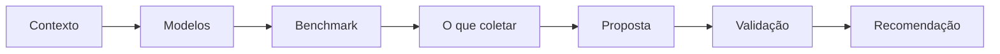

# Avaliação dos Serviços — Portal de Serviços do MS

Estudo conduzido pela **Secretaria-Executiva de Transformação Digital — SETDIG** para definir a estratégia de avaliação dos serviços disponibilizados no Portal de Serviços do Mato Grosso do Sul.

## Por onde começar

- **Quer entender o problema?** → [Contexto da Feature](01-contexto/feature.md)
- **Quer entender os modelos existentes?** → [Modelos de Avaliação](02-modelos/modelos-avaliacao.md)
- **Quer ver como outros fazem?** → [Benchmark](03-benchmark/visao-geral.md)
- **Quer entender o que coletar?** → [O que coletar do cidadão](04-cidadao/o-que-coletar.md)
- **Quer a proposta final?** → [Modelo proposto](05-proposta/modelo-proposto.md)
- **Quer o resumo executivo?** → [Recomendação](07-conclusao/recomendacao.md)

## Estrutura do estudo

## Pipeline de trabalho

`Estudar` → `Comparar cases` → `Definir o que coletar` → `Propor modelo` → `Validar proposta`

## Escopo

Este estudo cobre os cinco PBIs da Feature "Avaliação dos Serviços do Portal":

1. Estudo de modelos de avaliação de serviços.
2. Benchmark de plataformas digitais e de governo digital.
3. Definição das informações a coletar do cidadão.
4. Proposta de modelo de avaliação.
5. Estratégia de validação da proposta.

## Convenções

Cada afirmação factual está marcada com `[FATO]` + fonte. Interpretações e hipóteses estão explicitamente sinalizadas. Nada é inventado — quando uma informação não pôde ser confirmada, aparece `**Não identificado**` com a explicação da limitação.
