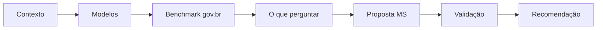

# Avaliação dos Serviços do Portal MS

Estudo estratégico da **SETDIG** para definir como o Portal de Serviços do MS vai avaliar seus serviços digitais junto ao cidadão.

## A pergunta central

> Como o cidadão do MS deve avaliar cada serviço digital que ele usa no Portal?

## A resposta em uma frase

Adotar o **modelo padrão do gov.br** — Central de Qualidade + Ferramenta de Avaliação (Portaria SGD/ME 548/2022) — adaptado ao contexto estadual, e evoluir de forma incremental a partir dele.

## Por onde começar a leitura

| Se você é… | Comece por… |
|---|---|
| Diretor/gestor querendo a recomendação | [Recomendação](07-conclusao/recomendacao.md) |
| Analista técnico querendo o modelo | [Modelo proposto](05-proposta/modelo-proposto.md) |
| Equipe do Portal querendo o padrão gov.br | [gov.br — Central de Qualidade](03-benchmark/gov-br.md) |
| Jurídico/DPO querendo o corte LGPD | [LGPD](04-cidadao/lgpd.md) |
| Alguém novo no assunto | [Modelos de Avaliação](02-modelos/modelos-avaliacao.md) |

## Por que este estudo

Serviço público bem avaliado é serviço mais bem gerido. A Lei 13.460/2017 (Código de Defesa do Usuário) já exige avaliação. O gov.br federal já padronizou o instrumento. Falta o MS operacionalizar isso no seu Portal com um modelo que:

1. Seja simples para o cidadão (não afugenta).
2. Gere dado útil para o gestor (não vira ruído).
3. Cumpra a LGPD (só coleta o que usa).
4. Permita comparação (entre serviços, no tempo).

## Escopo

- Levantamento de modelos e cases.
- Análise da referência principal (gov.br).
- Definição do que perguntar ao cidadão.
- Proposta concreta para o Portal MS.
- Estratégia para validar a proposta.

Fora do escopo: implementação técnica, dashboard pronto, pesquisa qualitativa com cidadãos.

## Como este documento está organizado

## Convenções

Cada afirmação factual é marcada `[FATO]` + fonte. Interpretações, hipóteses e recomendações são sinalizadas explicitamente. Quando algo não pôde ser confirmado, aparece `**Não identificado**` com a explicação.

Fontes completas em [`pesquisa/fontes.md`](pesquisa/fontes.md).
