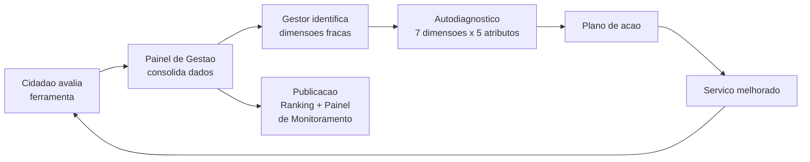
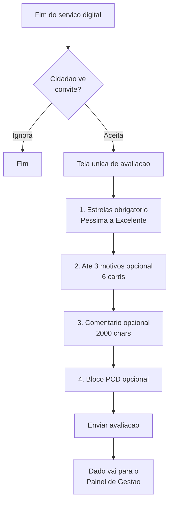

# Deep-dives — referências analisadas (gov.br e cases secundários)

> Material técnico de pesquisa. Consolidação dos deep-dives originais em `docs/03-benchmark/`, movidos para cá durante a consolidação de 2026-08-28. A síntese executiva vive em `docs/02-referencia.md`.

---

# Benchmark — Visão geral

## Referência primária: gov.br

Por decisão da chefia da equipe, **o gov.br é a referência principal deste estudo**. Todo o desenho da avaliação do Portal MS parte do modelo federal — pergunta, escala, cards, campo aberto, bloco de acessibilidade — e só se distancia dele quando houver razão explícita.

Três documentos concentram o estudo do modelo federal:

| Documento | Foco |
|---|---|
| [gov-br.md](./gov-br.md) | Visão consolidada do modelo (pergunta, escala, cards, PCD, base legal, aplicabilidade ao MS) |
| [central-de-qualidade.md](./central-de-qualidade.md) | Guarda-chuva estratégico: pilares, 7 dimensões, governança, ciclo de melhoria |
| [ferramenta-de-avaliacao.md](./ferramenta-de-avaliacao.md) | Peça operacional: formulário do cidadão, API, painel do gestor, cálculo |

`[FATO]` O modelo gov.br está operando em escala real: **1.047 serviços integrados, nota média 4,39/5** (dados publicados pela Central de Qualidade na data de acesso).

## Referências secundárias — cases de mercado

Cases privados foram estudados para calibrar boas práticas de UX, momento de coleta, uso do feedback e prevenção de vieses. **Não substituem o gov.br** — servem como fonte de padrões consolidados na indústria digital.

| Case | Contexto | Documento |
|------|----------|-----------|
| iFood | Delivery de comida (BR) | [ifood.md](./ifood.md) |
| Uber | Mobilidade urbana (global) | [uber.md](./uber.md) |
| Airbnb | Hospedagem entre pessoas (global) | [airbnb.md](./airbnb.md) |
| Google Play | Loja de apps Android (in-app review) | [google.md](./google.md) |
| Amazon | E-commerce (produto + vendedor) | [amazon.md](./amazon.md) |
| GOV.UK | Governo digital do Reino Unido | [gov-uk.md](./gov-uk.md) |

Comparativo tabular consolidado: [comparativo.md](./comparativo.md).

## O que os cases de mercado ensinam (destaque rápido)

1. **Escala visual simples** — todos convergem em 1–5 estrelas como métrica principal. Reforça a escolha do gov.br.
2. **Momento ancorado no evento** — Uber pede após viagem, iFood após pedido, Airbnb após check-out, gov.br pede após uso do serviço. Padrão consolidado.
3. **Campo aberto sempre opcional** — nenhum força comentário livre. gov.br segue o mesmo princípio.
4. **Skip permitido** — só o Uber trava (e é criticado por isso). Serviço público **jamais** deveria bloquear jornada por avaliação — princípio confirmado no Art. 7º §3º da Portaria SGD/ME 548/2022.
5. **Comunicar o que muda com o feedback** — cases sem retorno visível têm queda de participação. Vale para o Portal MS.
6. **Moderação obrigatória** — iFood e Amazon investem em ML + humano. MS precisa de política mínima antes de ir ao ar.
7. **Anti-viés** — Google Play proíbe pré-screening ("Está gostando?"); é boa prática a preservar.

Detalhamento completo de cada case nos respectivos arquivos.

## O que o gov.br tem que os cases privados não têm

`[INTERPRETAÇÃO]` Três diferenciais estruturais do modelo federal, essenciais para serviço público:

- **Bloco de acessibilidade** (PCD). Nenhum case privado analisado coleta essa informação.
- **Base legal explícita** (Lei 13.460, Decreto 9.094, Portaria SGD/MGI 1083/2025). Ancora o formulário em política pública, não em métrica de negócio.
- **Anonimato por default**. Cases privados operam com conta identificada; o gov.br assume avaliação anônima para reduzir atrito e aderir à LGPD.

## Fontes

Consolidado em [../pesquisa/fontes.md](../pesquisa/fontes.md).

---

# Central de Qualidade — gov.br

> Peça estratégica do modelo federal. Define o "para quê" e o "como comparar". A ferramenta operacional (formulário, API, painel) é tratada em [ferramenta-de-avaliacao.md](./ferramenta-de-avaliacao.md).

## O que é

`[FATO]` A Central de Qualidade se apresenta como: *"um espaço integrativo indutor de pontes de aproximação entre o cidadão e o governo digital com foco na qualidade da oferta de serviços públicos digitais."* Fonte: [Central de Qualidade — Governo Digital](https://www.gov.br/governodigital/pt-br/estrategias-e-governanca-digital/transformacao-digital/central-de-qualidade).

`[FATO]` Missão declarada: *"ajuda gestores públicos a melhorar a qualidade dos serviços digitais para os cidadãos, oferecendo boas práticas, materiais orientadores, metodologias e ferramentas."*

`[INTERPRETAÇÃO]` Na prática: a Central é o **guarda-chuva** que embala a Ferramenta de Avaliação, os Padrões de Qualidade, o Autodiagnóstico, os Selos de Maturidade e o Painel de Gestão sob uma governança única.

## Quem coordena

- **Secretaria de Governo Digital (SGD/MGI)** — coordenação estratégica e responsável normativo.
- **LabQ (Laboratório de Qualidade de Serviços Públicos do Governo Digital Federal)** — braço operacional. Laboratório de experimentação e redesenho de serviços.
- **Contato de apoio:** `labq@gestao.gov.br`.

`[FATO]` Data de referência do documento oficial: publicado em 12/08/2022; última atualização em 06/07/2026. Fonte: metadata da página Central de Qualidade.

## Quatro pilares

`[FATO]` A Central se estrutura em quatro produtos:

1. **Avaliação de Satisfação do Usuário** — o formulário do cidadão.
2. **Utilidade das Informações na Página do Serviço** — qualidade do conteúdo publicado (clareza, prazos, requisitos).
3. **Autodiagnóstico de Qualidade de Serviços Digitais** — instrumento interno do gestor, calcado nas 7 dimensões.
4. **Selos de Maturidade Digital** — reconhecimento público dos serviços que atingem determinados níveis.

Fonte: Central de Qualidade.

## Framework: 7 dimensões × 5 atributos

`[FATO]` Os **padrões de qualidade** federais organizam-se assim:

> *"Os padrões de qualidade são expressos em 7 (sete) dimensões que se desdobram em 5 (cinco) atributos"* — total: **35 padrões**. Fonte: [Padrões de Qualidade para Serviços Públicos Digitais](https://www.gov.br/governodigital/pt-br/estrategias-e-governanca-digital/transformacao-digital/central-de-qualidade/padroes-de-qualidade).

As sete dimensões:

| # | Dimensão | Foco |
|---|---|---|
| 1 | Facilidade | canais digitais, uso de login gov.br |
| 2 | Comunicação | informações atualizadas, notificações de status |
| 3 | Atendimento | múltiplos canais de suporte |
| 4 | Experiência unificada | integração em fluxo único |
| 5 | Acessibilidade | soluções como VLibras, padrões ABNT |
| 6 | Privacidade e segurança | proteção de dados pessoais |
| 7 | Escuta ativa | avaliações e testes com usuários |

`[INTERPRETAÇÃO]` As 7 dimensões são a "régua" da gestão — usada no Autodiagnóstico e nos Selos. **Não** são as opções que aparecem para o cidadão no formulário (o cidadão vê 6 cards de motivos positivos, ver [ferramenta-de-avaliacao.md](./ferramenta-de-avaliacao.md)).

## Papel na avaliação de serviços digitais

`[FATO]` Da própria página: o Painel de Gestão *"reúne dados e encaminhamentos personalizados que possibilitam a evolução contínua dos serviços prestados."* As notas são *"consolidadas, publicizadas e disponíveis publicamente"* no Portal GOV.BR, no Painel de Monitoramento de Serviços e no Ranking de Serviços e Órgãos.

`[FATO]` **Indicadores atuais publicados** (na data de acesso): 1.047 serviços integrados; nota média geral 4,39/5.

## Base legal

- **Portaria SGD/MGI nº 1.083, de 14/02/2025** — dispositivo vigente. *"Dispõe sobre a avaliação de satisfação dos usuários e estabelece padrões de qualidade."* Fonte: [Biblioteca Digital MGI](https://bibliotecadigital.gestao.gov.br/handle/123456789/533149).
- **Portaria SGD/MGI nº 6.618, de 25/09/2024** — Estratégia Federal de Governo Digital.
- **Portaria SGD/ME nº 548, de 24/01/2022** — instituiu o modelo (foi o marco anterior; revisada em 2025).

## Ciclo de melhoria

`[INTERPRETAÇÃO]` A Central fecha o loop: cidadão avalia → dado vai para o gestor → gestor tem instrumento (autodiagnóstico) → executa plano → cidadão nota diferença → avalia de novo. É o desenho ideal; a maturidade real varia por órgão.

## Aplicabilidade ao MS

`[RECOMENDAÇÃO]` O MS pode replicar o modelo em três camadas:

1. **Formulário do cidadão** — copiar o padrão gov.br (ver [ferramenta-de-avaliacao.md](./ferramenta-de-avaliacao.md)).
2. **Framework de dimensões** — adotar as 7 dimensões federais como referência interna, ajustando o número de atributos conforme capacidade da SETDIG.
3. **Painel de Gestão + Ranking interno** — imprescindível para o loop de melhoria funcionar. Sem painel, a coleta vira dado morto.

`[HIPÓTESE]` Um "LabQ-MS" (equivalente estadual do laboratório federal) seria o dono natural desse produto — pode nascer como célula pequena dentro da SGD/SETDIG e crescer conforme a demanda.

## Fontes

- Central de Qualidade — https://www.gov.br/governodigital/pt-br/estrategias-e-governanca-digital/transformacao-digital/central-de-qualidade
- Padrões de Qualidade — https://www.gov.br/governodigital/pt-br/estrategias-e-governanca-digital/transformacao-digital/central-de-qualidade/padroes-de-qualidade
- Avaliação de Satisfação (LabQ) — https://www.gov.br/governodigital/pt-br/estrategias-e-governanca-digital/transformacao-digital/central-de-qualidade/labq/avaliacao-de-satisfacao-do-usuario
- Portaria SGD/MGI 1083/2025 — https://bibliotecadigital.gestao.gov.br/handle/123456789/533149

---

# Ferramenta de Avaliação — gov.br

> Peça operacional do modelo federal. O guarda-chuva estratégico é tratado em [central-de-qualidade.md](./central-de-qualidade.md).

## O que é

`[FATO]` A Ferramenta de Avaliação é a solução técnica que executa, na prática, a Avaliação de Satisfação dos Usuários dos serviços públicos digitais federais. É descrita como *"solução pronta e integrada ao GOV.BR, que permite coletar a opinião dos cidadãos sobre os serviços digitais prestados, de forma simples, segura e padronizada."* Fonte: [Avaliação de Satisfação do Usuário — LabQ](https://www.gov.br/governodigital/pt-br/estrategias-e-governanca-digital/transformacao-digital/central-de-qualidade/labq/avaliacao-de-satisfacao-do-usuario).

`[FATO]` A ferramenta compõe três elementos técnicos:

1. **Componente de UI** exibido ao cidadão dentro do fluxo do serviço.
2. **API de Avaliação** consumida pelos órgãos para gerar links e receber notificações.
3. **Painel de Gestão da Qualidade** para acompanhamento pelo gestor.

## O que o cidadão vê (formulário completo)

### 1. Cabeçalho contextual

`[FATO]` Exibe o rótulo *"Avaliação do Serviço"* seguido do nome do serviço e do órgão responsável. Exemplo real (`image.png`): *"Realizar a Assinatura Eletrônica de documentos — Ministério da Gestão e da Inovação em Serviços Públicos (MGI)"*.

### 2. Pergunta principal + estrelas

`[FATO]` Enunciado: **"Como foi a sua experiência com o serviço?"**

`[FATO]` Escala de 5 estrelas com rótulos textuais fixos:

| Estrelas | Rótulo |
|---|---|
| 1 | Péssima |
| 2 | Ruim |
| 3 | Mais ou menos |
| 4 | Boa |
| 5 | Excelente |

Fonte: página LabQ; corroborado pela tela oficial (`image.png`).

### 3. Segunda pergunta — motivos positivos (opcional)

`[FATO]` Enunciado: **"O que você mais gostou em nosso serviço? (opcional) — Marque até 3 opções"**. Seis cards clicáveis com ícone:

- Fácil de usar
- Site/aplicativo funcionou bem
- Informações claras
- Consegui resolver
- Foi rápido
- Fácil de encontrar

`[INTERPRETAÇÃO]` A ferramenta captura **motivos positivos**, não termômetro genérico. Isso é uma escolha metodológica: dá à gestão um sinal acionável ("o que funcionou bem?") em vez de forçar o cidadão a dissecar problemas.

### 4. Campo aberto (opcional)

`[FATO]` Enunciado: **"Deixe elogio, sugestão ou crítica (opcional):"** com placeholder *"Para que possamos melhorar o serviço, conte-nos sobre sua experiência."*

`[FATO]` Limite: **2000 caracteres**, com contador regressivo visível ("2000 caracteres restantes"). Fonte: tela oficial (`image copy.png`).

### 5. Bloco acessibilidade (opcional)

`[FATO]` Bloco separado destacado: **"Ajude-nos a melhorar a acessibilidade (opcional)"**.

`[FATO]` Aviso "Saiba mais": *"Para garantir que nossos serviços atendam todas as pessoas, gostaríamos de saber mais sobre você."*

`[FATO]` Pergunta única: **"Você se considera uma pessoa com deficiência?"** com radio Sim/Não.

Fonte: tela oficial (`image copy.png`).

### 6. Botão de envio

`[FATO]` Botão **"Enviar avaliação"** em azul, único CTA da tela.

### 7. Anonimato

`[FATO]` O formulário **não solicita CPF, nome, e-mail ou qualquer identificação obrigatória**. A avaliação é anônima por design — decisão explícita da SGD que reduz atrito e minimiza superfície de dados pessoais (aderência à LGPD).

## Fluxo do cidadão

`[FATO]` Momento típico: após conclusão do serviço. O órgão pode:

- Gerar **link direto** de avaliação via API ao encerrar o atendimento; ou
- Deixar o **componente permanentemente disponível** na página do serviço no gov.br.

## Como o órgão integra (API)

`[FATO]` Gestores solicitam **credenciais de integração** para usar a API de Avaliação via formulário na plataforma de solicitação da SGD. Fonte: página LabQ.

`[HIPÓTESE]` A API pública documentada em `manual-avaliacao.servicos.gov.br` cobre: geração de link de avaliação, recebimento de resultados, consulta de notas agregadas. **Não identificado** SLA ou throttling oficial nesta pesquisa.

`[FATO]` Contato de apoio: `labq@gestao.gov.br`.

## O que o gestor vê (Painel de Gestão)

`[FATO]` **Painel de Gestão da Qualidade de Serviços Digitais** — acesso restrito a gestores e editores cadastrados. Consolida:

- Notas médias por serviço e por período.
- Distribuição de estrelas (histograma).
- Frequência dos 6 motivos positivos escolhidos.
- Comentários abertos (moderados).
- Encaminhamentos personalizados para melhoria.

`[FATO]` Além do painel restrito, três visualizações **públicas**:

1. **Página do serviço no gov.br** — nota média e nº de avaliações à vista do próximo cidadão.
2. **Painel de Monitoramento de Serviços Federais** — visão consolidada federal.
3. **Ranking de Serviços e de Órgãos** — comparação pública entre unidades.

## Cálculo do índice de satisfação

`[HIPÓTESE]` Média aritmética simples das notas por serviço, publicada como "nota de 1 a 5" (ex.: 4,39). **Não identificada** fórmula ponderada oficial (por recência, por volume, por dimensão) na documentação pública consultada.

`[INTERPRETAÇÃO]` Um MS que replique deve decidir se aplica ponderação (útil se houver risco de manipulação por poucos avaliadores) ou mantém média simples (mais transparente e defensável publicamente).

## Base legal (dispositivos que amarram o formulário)

Da **Portaria SGD/ME 548/2022** (marco anterior, ainda muito citado):

- **Art. 7º, § 1º:** *"O nível de satisfação será indicado pelo usuário em escala de cinco pontos."*
- **Art. 7º, § 3º:** *"A avaliação de satisfação não poderá ser uma etapa obrigatória da jornada do usuário."* — princípio fundamental: **avaliação nunca bloqueia serviço**.
- **Art. 8º:** *"As unidades gestoras deverão utilizar a ferramenta de avaliação disponibilizada pela Secretaria de Governo Digital."*
- **Art. 12:** *"A Secretaria de Governo Digital calculará e divulgará as notas médias de satisfação dos usuários por serviço, por órgão ou entidade e global, com periodicidade mensal."*
- **Art. 13, parágrafo único:** ranking classificatório por proporção de serviços integrados.

Fonte: [Portaria 548/2022 — Legislação Contábil (transcrição)](https://legislacao.contabil.business/1643134772). A norma **vigente** é a [Portaria SGD/MGI 1083/2025](https://bibliotecadigital.gestao.gov.br/handle/123456789/533149), que revisou e aprimorou esses dispositivos.

## Adoção por estados e municípios

`[HIPÓTESE]` A Portaria 1083/2025 disciplina o **Executivo Federal**. **Não identificado** procedimento formal público de adesão de entes subnacionais à ferramenta federal.

`[RECOMENDAÇÃO]` Para o MS, dois caminhos:

1. **Replicar o modelo em plataforma própria** (menor risco de dependência; controle total).
2. **Conversar diretamente com a SGD** para explorar cooperação/uso da API — caminho promissor mas depende de acordo institucional.

## Confirmações vs. imagens de referência

Todos os elementos da tela oficial anexada (`image.png` + `image copy.png`) foram **confirmados pela documentação pública**. Nenhum desvio identificado.

## Fontes

- Ferramenta de Avaliação (página institucional) — https://www.gov.br/governodigital/pt-br/plataformas-e-servicos-digitais/ferramenta-de-avaliacao
- Avaliação de Satisfação (LabQ) — https://www.gov.br/governodigital/pt-br/estrategias-e-governanca-digital/transformacao-digital/central-de-qualidade/labq/avaliacao-de-satisfacao-do-usuario
- Portaria SGD/ME 548/2022 (transcrição) — https://legislacao.contabil.business/1643134772
- Portaria SGD/MGI 1083/2025 (Biblioteca Digital) — https://bibliotecadigital.gestao.gov.br/handle/123456789/533149
- Manual API de Avaliação — https://manual-avaliacao.servicos.gov.br/pt-br/latest/faq.html

---

# Benchmark — GOV.UK (Reino Unido)

> Fonte principal: GOV.UK Service Manual, GDS Blog. Todas as observações marcadas `[FATO]`/`[INTERPRETAÇÃO]`/`[HIPÓTESE]`.

## Contexto da plataforma

GOV.UK é o portal único de serviços públicos do Reino Unido, operado pelo **Government Digital Service (GDS)**. Modelo consolidado desde 2012, referência mundial em governo digital. Coexistem no ecossistema:

- **gov.uk** — portal informacional único.
- **Serviços transacionais** — cada agência entrega seu serviço seguindo o *Service Standard* comum.
- **Plataformas comuns** — GOV.UK Pay, GOV.UK Notify, GOV.UK One Login.

## Modelo de avaliação

`[FATO]` **Descentralizado com padrões comuns**. Não há um "botão único gov.uk de nota 1–5". O GDS define o **Digital Service Standard**, que obriga cada equipe a:

- Medir satisfação **continuamente** enquanto o serviço está no ar.
- Publicar dados **pelo menos uma vez por mês**.
- Coletar feedback em **múltiplos endpoints** (formulário no site, e-mail pós-serviço, tickets de suporte, redes sociais, entrevistas).

`[FATO]` Adicionalmente, cada página do `gov.uk` tem um widget universal:

> "Is this page useful?" → **Yes / No** → se "No", campo aberto "How can we improve this page?"

## Perguntas, escala e momento

`[FATO]` **Sem template obrigatório**: "There is no formal guidance on what questions you must ask" (Service Manual). O GDS orienta que cada serviço:

- Inclua **pelo menos uma pergunta aberta** sobre como melhorar o serviço.
- Meça satisfação em escala Likert (comumente **5 pontos**, "very dissatisfied" → "very satisfied").
- Colete feedback em **vários pontos do fluxo**, não só no final.

`[FATO]` **Exemplo GOV.UK Pay (2024)**: envia survey por e-mail a usuários que logaram ≥1 vez nos últimos 12 meses. Escala Likert por feature. Amostra 2023: 3.444 destinatários (apenas usuários profissionais do serviço, não cidadãos finais).

`[FATO]` **Exemplo GOV.UK Notify (2022)**: também usa survey Likert com foco em feature-level satisfaction.

## Uso pela gestão

`[FATO]` GDS descreve pipeline replicável:

1. Coleta multi-canal (survey + suporte + user research + analytics).
2. Triangulação — nenhum canal isolado decide roadmap.
3. Priorização de melhorias no roadmap do serviço.
4. **Exemplo concreto**: 50% dos respondentes da survey GOV.UK Pay 2022 pediram *pay-by-bank* → equipe abriu descoberta técnica em 2023.

`[FATO]` Dados agregados são publicados em `data.gov.uk` como dataset "User Satisfaction survey".

## Base legal

`[FATO]` Não há lei específica do parlamento sobre pesquisa de satisfação. As obrigações vêm de:

- **Digital Service Standard** — política interna do governo, condição para serviços passarem por *service assessment* e serem publicados no gov.uk.
- **Data Protection Act 2018 + UK GDPR** — para tratamento de dados pessoais coletados.

## Aprendizados aplicáveis ao MS

1. **Widget universal de 1 pergunta + campo aberto condicional** (modelo "Is this page useful?") é barato, ubíquo e escalável — reduz atrito, permite ler tendências agregadas por página.
2. **Padronizar `Service Standard` local** — obrigação de medir + publicar mensalmente cria disciplina sem impor formato único que engessa todos os serviços.
3. **Triangular fontes** — CSAT sozinho engana. Combinar com dados de suporte/ouvidoria (Fala.MS?) + analytics.
4. **Publicação em `dados.ms.gov.br`** — expor dataset de satisfação como dado aberto, replicando `data.gov.uk`, aumenta accountability e permite reuso.
5. **Pergunta aberta sempre presente** — é o item mais defendido pelo Service Manual e o mais barato de implementar.
6. **Não pedir identificação** por padrão — GOV.UK Pay só faz survey identificado porque destinatários já são usuários autenticados profissionais; feedback do site é anônimo.

## Fontes

- GOV.UK Service Manual — Measuring user satisfaction: https://www.gov.uk/service-manual/measuring-success/measuring-user-satisfaction
- GDS Blog — Improving GOV.UK Pay with satisfaction feedback (2024): https://gds.blog.gov.uk/2024/01/29/how-we-are-improving-gov-uk-pay-with-user-satisfaction-feedback/
- GDS Blog — Understanding user satisfaction on GOV.UK Notify (2022): https://gds.blog.gov.uk/2022/11/09/understanding-user-satisfaction-on-gov-uk-notify
- data.gov.uk — User Satisfaction survey dataset: https://www.data.gov.uk/dataset/63e35a14-492b-4577-89e5-a03c5c365c00/user-satisfaction-survey
- GDS Blog — tag user-satisfaction: https://gds.blog.gov.uk/tag/user-satisfaction

---

# Benchmark — iFood

Marcadores: `[FATO]`, `[INTERPRETAÇÃO]`, `[HIPÓTESE]`.

## Contexto

iFood é a maior plataforma de delivery de comida do Brasil. Conecta cliente → restaurante → entregador em um único fluxo. Avaliação existe em três eixos separados (restaurante, entrega, plataforma) e alimenta um sistema de reputação que impacta a exposição comercial do parceiro.

## Como funciona a avaliação

Após concluído o pedido, o iFood abre uma janela de **7 dias** para o cliente avaliar. O fluxo é composto de três blocos sequenciais [FATO]:

1. **Restaurante** — nota de 1 a 5 estrelas + tags opcionais (comida saborosa, boa embalagem, boa quantidade etc.) + comentário livre opcional.
2. **Entrega** — pergunta binária "O pedido chegou no tempo informado?" (Sim/Não) + comentário opcional.
3. **iFood (plataforma)** — pergunta NPS: "De 0 a 10, quanto você nos recomendaria".

## Momento e gatilho

- [FATO] A tela de estrelas aparece na reabertura do app após a finalização do pedido.
- [FATO] Notificações push são enviadas.
- [FATO] Acesso permanente via aba "Pedidos" durante os 7 dias.

## Perguntas e escala

| Bloco | Pergunta | Escala | Obrigatório |
|-------|----------|--------|-------------|
| Restaurante | Estrelas + "o que pode melhorar" (tags) | 1–5 estrelas | Estrelas sim; tags e texto não |
| Entrega | "O pedido chegou no tempo informado?" | Sim / Não | [INTERPRETAÇÃO] Sim |
| iFood (NPS) | "De 0 a 10, quanto você nos recomendaria" | 0–10 | [INTERPRETAÇÃO] Sim |

O comentário livre é sempre opcional [FATO].

## Uso pela plataforma

- [FATO] Nota exibida ao cliente é média dos últimos **90 dias**.
- [FATO] Novo restaurante só tem nota pública após ≥10 avaliações em 21+ dias ativos.
- [FATO] Nota abaixo de **4,5** reduz a exposição do restaurante nas listagens.
- [FATO] Nota mínima **3,0** para participar do Super Restaurante e habilitar iFood Anúncios.
- [FATO] Moderação automática descarta ofensas, linguagem inadequada, reclamações logísticas e fraudes — não contam para a nota.

## Retorno ao usuário

- [FATO] Restaurante tem até 5 dias para responder à avaliação; 10 minutos para editar a resposta.
- [FATO] Cliente é notificado quando o restaurante responde e pode revisar a nota original.
- **Não identificado** thank-you screen após envio (buscado em Central de Ajuda iFood).

## Skip

- **Não identificado** política formal de skip. [INTERPRETAÇÃO] Como o app segue funcional sem avaliar e o prazo é 7 dias, o skip é permitido de fato.

## Aprendizados aplicáveis a serviços públicos

1. **Separar dimensões diferentes de avaliação.** iFood separa "o restaurante", "a entrega" (execução) e "o iFood" (canal). Análogo no MS: separar "avaliação do serviço público específico solicitado" (secretaria/órgão) de "avaliação do Portal" (canal digital). Impede que problema de canal contamine avaliação do serviço.
2. **Tags padronizadas > texto livre** para captura de sinal quantificável ("boa embalagem", "quantidade adequada"). No MS: "atendimento cordial", "prazo cumprido", "informação clara", "resolveu meu problema".
3. **Janela finita para avaliar** (7 dias) evita reviews descoladas do evento. Aplicável ao Portal.
4. **Média móvel de 90 dias** evita que um erro antigo puna eternamente o prestador — princípio útil para avaliar órgãos públicos com sazonalidade de demanda.
5. **Moderação com regra clara** (o que é descartado) protege o prestador contra ataques injustos — essencial em serviço público sensível a ruído político.
6. **Direito de resposta** do prestador humaniza o feedback e cria loop de melhoria. No MS, secretaria poderia responder publicamente a avaliações — modelo Reclame Aqui adaptado.
7. **NPS separado para o canal** dá uma métrica única de saúde do produto digital, útil para gestão do Portal.

## Fontes

1. Central de Ajuda iFood — "Avaliações de Pedidos iFood": https://institucional.ifood.com.br/ajuda/avaliacoes-de-pedidos-ifood/
2. Blog Parceiros iFood — "Como funcionam as avaliações e suas moderações": https://blog-parceiros.ifood.com.br/avaliacoes-e-moderacoes/
3. Blog Parceiros iFood — "Avaliação iFood: saiba como melhorar a sua": https://blog-parceiros.ifood.com.br/avaliacao-ifood/
4. Saipos — "Como Avaliar no iFood: passo a passo e dicas": https://saipos.com/integracoes/ifood/como-avaliar-um-pedido-no-ifood
5. Comunidade iFood — "Como avaliar o delivery do seu pedido no iFood": https://comunidade.ifood.com.br/t/como-avaliar-o-delivery-do-seu-pedido-no-ifood/113
6. A Batata Que Voa — "Como Melhorar Avaliação no iFood": https://abatataquevoa.com.br/como-melhorar-avaliacao-no-ifood/
7. MultiKitchen — "Como conquistar e manter avaliações 5 estrelas no iFood": https://blog.multikitchen.com.br/post/conquistar-manter-avaliacoes-5-estrelas-ifood

---

# Benchmark — Uber

Marcadores: `[FATO]`, `[INTERPRETAÇÃO]`, `[HIPÓTESE]`.

## Contexto

Uber é a maior plataforma global de mobilidade urbana on-demand. O sistema de rating é bidirecional (motorista avalia passageiro e vice-versa), anônimo e com peso operacional real: motoristas com nota baixa perdem acesso à plataforma; passageiros mal avaliados podem ser desativados.

## Como funciona a avaliação

Ao final de cada viagem, uma tela in-app pede que o passageiro atribua **1 a 5 estrelas**. A tela é bloqueante: o passageiro **não pode reservar outra corrida sem avaliar a última** [FATO — Uber Help].

Após dar a nota:
- **Se 5 estrelas** → o app oferece uma lista de "compliments" (elogios pré-definidos: "Great conversation", "Clean car", "Expert navigation" etc.).
- **Se menos de 5 estrelas** → o app oferece uma lista de "common issues" para especificar o problema. Comentário livre é opcional.

Em seguida, aparece a tela de gorjeta (opcional, disponível por até 30 dias após a corrida).

## Momento e gatilho

- [FATO] Tela in-app aparece imediatamente após o término da viagem.
- [FATO] Se o usuário fechar o app sem avaliar, a avaliação será exigida antes da próxima corrida (soft-lock).
- [INTERPRETAÇÃO] Notificação push também é comum (padrão do app), embora não confirmado em fonte primária consultada.

## Perguntas e escala

| Item | Detalhe |
|------|---------|
| Pergunta principal | Referida como "rate your trip" nas fontes oficiais; texto literal não confirmado |
| Escala | 1–5 estrelas |
| Perguntas condicionais | Sim: compliment (5★) ou motivo (<5★) |
| Campo aberto | Opcional em todos os casos |
| Dimensões | Uma única — a viagem/motorista como um todo (sem sub-scores) |

## Uso pela plataforma

- [FATO] Nota do motorista = média dos últimos **500 ratings** de passageiros.
- [FATO] Ratings são **anônimos** — nem motorista nem passageiro vê o rating individual de uma viagem específica.
- [FATO] Sistema exclui automaticamente ratings de passageiros que "frequentemente dão notas baixas" e viagens afetadas por fatores externos (trânsito, cancelamento etc.).
- [FATO] Notas consistentemente baixas → menos corridas e possível desativação.
- [FATO] Notas altas → benefícios (Uber Pro, categorias premium).
- **Não identificado** threshold numérico oficial de desativação. Imprensa cita ~4,6, mas Uber não confirma publicamente.
- [FATO] Rider (passageiro) só passa a ter nota exibida após 5 viagens; drivers começam com 5,00 e a nota flutua até acumular 100+ ratings.

## Retorno ao usuário

- **Não identificado** thank-you screen ou resposta ao passageiro após submissão.
- [INTERPRETAÇÃO] Passageiro apenas volta à Home após avaliar. Não existe canal para o motorista responder à nota do passageiro (e vice-versa) — ratings são anônimos por design.

## Skip

- [FATO] Passageiro pode **adiar**, mas não pode reservar próxima viagem sem avaliar.
- [INTERPRETAÇÃO] Efetivamente obrigatório para uso continuado. Único case do benchmark com essa característica.

## Aprendizados aplicáveis a serviços públicos

1. **Ancorar no momento do evento.** A avaliação aparece na hora em que a experiência ainda está fresca — passa a taxa de resposta é alta porque não depende de o usuário lembrar de voltar depois. Aplicável ao Portal: mostrar a avaliação na tela final de conclusão do serviço.
2. **Uma pergunta principal + tags condicionais.** O fluxo Uber é radicalmente simples: uma nota, depois um refinamento *só se necessário*. No MS: nota geral (1–5), depois motivos padronizados (só se <4).
3. **NÃO copiar o soft-lock.** Bloquear próxima solicitação até avaliar é rating pressure — gera respostas apressadas, viés positivo (5★ automático para se livrar da tela) e ressentimento. Serviço público não pode se dar ao luxo de forçar avaliação. Uber é criticado justamente por isso.
4. **Anonimato do avaliador é essencial em contexto sensível.** No MS, cidadão precisa ter garantia de que a avaliação negativa não vai gerar retaliação do órgão avaliado. Adotar anonimato pelo menos para o servidor final (agregado por órgão, sim; nome do cidadão, não).
5. **Ponderação inteligente.** Uber exclui ratings de usuários abusivos e de contextos externos. No MS, ponderar: excluir avaliação de solicitações canceladas por erro do cidadão, ou reduzir peso de avaliadores que só dão 1 ou 5 sistematicamente.
6. **Compliments** (o lado positivo do rating condicional) valorizam bons prestadores. No MS: se cidadão dá 5★, oferecer "elogios" pré-definidos ("atendimento cordial", "prazo rápido") para acumular reconhecimento para o órgão/servidor.

## Fontes

1. Uber Help — Rating a driver: https://help.uber.com/riders/article/rating-a-driver?nodeId=478d7463-99cb-48ff-a81f-0ab227a1e267
2. Uber Help — Rating FAQs: https://help.uber.com/en/riders/article/rating-faqs/?nodeId=0539e772-747c-49a7-8c26-f28c65e6f14d
3. Uber Help — Understanding ratings (driver): https://help.uber.com/en/driving-and-delivering/article/understanding-ratings?nodeId=9e240708-a894-43d7-b19d-13061a4fbe5a
4. Uber Driver App Basics — How ratings work: https://www.uber.com/us/en/drive/basics/how-ratings-work/
5. Uber Blog — How the Uber rating system works: https://www.uber.com/en-EG/blog/how-the-uber-rating-system-works
6. Ridester — Uber Driver Ratings: https://www.ridester.com/uber-driver-ratings/
7. Ridester — What Your Uber Rider Rating Means: https://www.ridester.com/uber-rider-ratings/

---

# Benchmark — Airbnb

Marcadores: `[FATO]`, `[INTERPRETAÇÃO]`, `[HIPÓTESE]`.

## Contexto

Airbnb é a maior plataforma global de hospedagem entre pessoas. A reputação (tanto de anfitrião quanto de hóspede) é o principal ativo do sistema — sem confiança bilateral, ninguém aluga ou aluga para ninguém. O sistema de reviews é conhecido por dois mecanismos originais: **double-blind** e prazo rígido de **14 dias**.

## Como funciona a avaliação

Ao check-out, o relógio de 14 dias começa a correr para ambos os lados [FATO]. Hóspede avalia o anfitrião e vice-versa. Nenhum dos dois vê a review do outro até que:

- Ambos submetam, **ou**
- Os 14 dias expirem.

Isso caracteriza o **double-blind review**: cada lado escreve sem saber o que o outro escreveu, o que remove incentivo a retaliação ou reciprocidade forçada [FATO].

Quando a janela fecha (por submissão mútua ou expiração), as reviews são publicadas simultaneamente e passam a ser visíveis nos perfis públicos.

## Momento e gatilho

- [FATO] Cronômetro de 14 dias começa no check-out.
- [FATO] Notificação in-app + e-mail solicitando a avaliação.
- [INTERPRETAÇÃO] Lembretes periódicos durante a janela (padrão do produto).

## Perguntas e escala

| Item | Detalhe |
|------|---------|
| Nota geral | 1–5 estrelas (independente — **não é média** das subcategorias) [FATO] |
| Subcategorias | 6 dimensões: limpeza, precisão do anúncio, check-in, comunicação, localização, custo-benefício — cada uma 1–5 estrelas [FATO] |
| Review pública | Texto livre visível a futuros hóspedes |
| Feedback privado | Texto livre visível apenas ao anfitrião |
| Direção | Bidirecional — host avalia guest também (comunicação, limpeza, cumprimento de regras) |

**Não identificado** obrigatoriedade formal do texto público em fonte oficial. [INTERPRETAÇÃO] Estrelas gerais parecem ser o único campo estritamente obrigatório.

## Uso pela plataforma

- [FATO] Nota geral (não as subcategorias) determina a média do anúncio.
- [FATO] Reviews impactam ranking do anúncio e elegibilidade a status Superhost.
- [FATO] Anfitrião pode responder publicamente à review — sem prazo definido, resposta publica imediatamente.
- [INTERPRETAÇÃO] Guest também acumula reputação no perfil, visível a futuros hosts na hora da aprovação.

## Retorno ao usuário

- [FATO] Guest recebe a review pública do host no seu próprio perfil.
- **Não identificado** thank-you screen específica após submissão.
- [INTERPRETAÇÃO] O "retorno" é estrutural: a review do outro lado só aparece após o guest submeter — cria um incentivo natural para avaliar (se não avaliar, perde a chance de ver a review do host).

## Skip

- [FATO] Se o guest não avaliar em 14 dias, a janela fecha e a review do host (se submetida) publica sozinha.
- [INTERPRETAÇÃO] Skip é permitido tecnicamente, mas tem custo: perde-se a review pública do host e a chance de reciprocidade.

## Aprendizados aplicáveis a serviços públicos

1. **Double-blind é ouro em contexto de retaliação.** Se o Portal MS permitir que o servidor veja quem avaliou, aplicar mecanismo similar: servidor não vê nome do cidadão até responder (ou nunca vê). Isso protege ambos os lados de viés.
2. **Prazo finito** (14 dias) mantém as reviews fresquíssimas ao contexto. Aplicável ao Portal.
3. **Múltiplas dimensões só se o serviço for rico.** As 6 categorias do Airbnb (limpeza, comunicação etc.) fazem sentido porque hospedagem tem muitos atributos. Serviço público geralmente é mais transacional — 1–3 dimensões bastam (ex: facilidade, atendimento, resolutividade).
4. **Nota geral independente das subcategorias** é interessante psicologicamente: obriga o avaliador a pensar duas vezes. "O serviço foi 4 na comunicação e 5 no atendimento — no geral, quanto?" evita nota-média enganosa.
5. **Feedback privado** (visível apenas ao prestador, não público) é canal poderoso para melhoria interna sem expor o órgão a ranking negativo por detalhe operacional pequeno.
6. **Direito de resposta pública do prestador** cria simetria — o cidadão vê que sua reclamação foi lida e respondida, não caiu no vazio.

## Fontes

1. Hostfully — "Airbnb Review Policy Explained (2026)": https://www.hostfully.com/blog/airbnb-review-policy/
2. Uplisting — "Airbnb Review Policy: Tips, Removal, and Host Guidelines": https://www.uplisting.io/blog/airbnb-review-policy-quick-guide
3. Houst — "Airbnb Reviews: How They Work for Hosts (2026)": https://www.houst.com/blog/airbnb-review
4. Comunidade Airbnb — "Reviews: how does the 14 days time frame work": https://community.withairbnb.com/t5/Help-with-your-business/Reviews-how-does-the-14-days-time-frame-work/m-p/2261439
5. STR Assistance — "How to Leave a Review on Airbnb After 14 Days": https://strassistance.com/how-to-leave-a-review-on-airbnb-after-14-days/
6. arXiv — "More Reviews May Not Help: Evidence from Incentivized First Reviews on Airbnb": https://arxiv.org/pdf/2112.09783
7. Touchstay — "50+ Airbnb Guest Review Templates & Examples for Hosts": https://touchstay.com/blog/airbnb-guest-review-templates

---

# Benchmark — Google Play (In-App Review API)

Marcadores: `[FATO]`, `[INTERPRETAÇÃO]`, `[HIPÓTESE]`.

## Contexto

Google Play é a loja oficial de apps Android. Rating de app (1–5 estrelas + comentário) é peça central da descoberta e da confiança na loja. Em 2020, o Google lançou a **In-App Review API**: um card nativo que aparece dentro do app, sem redirecionar para a Play Store, e cuja UI/UX é rigidamente controlada pelo Google — o dev não pode customizar aparência, texto ou momento sem seguir regras estritas.

## Como funciona a avaliação

O desenvolvedor invoca `launchReviewFlow()` no momento que julgar apropriado. O Google exibe um card nativo com:
- Nome do app + ícone
- **1 a 5 estrelas**
- Campo de comentário opcional
- Botão de submit

O usuário pode fechar o card a qualquer momento. Após interagir (submetendo ou fechando), o controle volta ao app **sem mudar o fluxo do usuário** — o dev não sabe nem se o usuário avaliou nem qual foi a nota [FATO].

## Momento e gatilho

- [FATO] O desenvolvedor escolhe quando chamar. Google recomenda: "após o usuário ter experimentado o app o suficiente para dar feedback útil".
- [FATO] **PROIBIDO** interromper tarefas críticas do usuário.
- [FATO] **PROIBIDO** criar botão do tipo "Avalie o app" que dispare a API — porque o usuário pode já ter batido a quota e ficar frustrado com um card que não aparece.

## Perguntas e escala

| Item | Detalhe |
|------|---------|
| Pergunta | UI padrão do Google, não customizável |
| Escala | 1–5 estrelas |
| Nº perguntas | Uma tela — estrelas + comentário opcional |
| Campo aberto | Opcional |
| Dimensões | Uma — o app |
| Customização | **Zero** — dev não pode alterar tamanho, opacidade, forma do card |

## Uso pela plataforma

- [FATO] Rating alimenta a nota agregada do app na loja.
- [FATO] Comentário vira review público na página do app.
- [FATO] Desenvolvedor pode responder aos reviews via Play Console; usuário recebe notificação por e-mail quando o dev responde.

## Retorno ao usuário

- [FATO] O app "continua sem alterar o fluxo do usuário" — nenhum thank-you, nenhum bloqueio.
- [FATO] Se o dev responder ao review pela Play Console, o usuário recebe e-mail.

## Skip

- [FATO] Usuário pode fechar o card a qualquer momento; o dev **não pode** tratar isso como falha nem tentar novamente logo em seguida.
- [FATO] **Quota rígida do Google**: chamar `launchReviewFlow()` mais de uma vez em curto período (< ~1 mês por usuário) simplesmente não exibe o dialog. O Google enforça isso para evitar fadiga.
- [FATO] **PROIBIDO pré-screening**: o app **não pode** perguntar "Você está gostando?" ou "Você daria 5 estrelas?" antes de mostrar o card. Isso está explicitamente vedado pelas Google Play Developer Program Policies.
- [INTERPRETAÇÃO] A quota + a proibição de pré-screening juntas eliminam dois abusos comuns: bombardear o usuário e viés seletivo (só pedir review para quem parece feliz).

## Aprendizados aplicáveis a serviços públicos

1. **Anti-fadiga por design.** Quota máxima por usuário/período evita que o cidadão seja bombardeado toda vez que abre o Portal. Simples de implementar: cookie/registro de "última solicitação de avaliação" com cool-down de X dias.
2. **Proibir pré-screening é uma regra ética direta.** Portais governamentais **não devem** perguntar "Você teve uma boa experiência?" antes de mostrar o formulário — isso enviesa a amostra, filtra descontentes e destrói o valor da nota agregada. Google já fez o trabalho de justificar essa política; copiar.
3. **UI padronizada** reduz decisão do dev e uniformiza a experiência. No MS, definir um componente único de avaliação usado em **todos** os serviços do Portal — não deixar cada secretaria inventar o próprio.
4. **Não bloquear o fluxo.** Card leve, dispensável, sem consequência. Cidadão que fecha volta exatamente pra onde estava. Fundamental para não gerar ódio ao Portal.
5. **Não usar como CTA.** Botão "Avalie o Portal!" no menu é anti-padrão — quem clica é minoria polarizada (muito feliz ou muito irritado), enviesando a amostra. Melhor mostrar contextualmente após uso de fato.
6. **Responder ao review notifica o cidadão por e-mail** — canal simples de fechar o ciclo e mostrar que a nota foi lida. No MS: cidadão avalia, órgão responde, cidadão recebe e-mail. Fecha loop com custo baixo.

## Fontes

1. Android Developers — In-App Review API guide: https://developer.android.com/guide/playcore/in-app-review
2. Android Developers Blog — "Leverage the In-App Review API": https://android-developers.googleblog.com/2020/08/in-app-review-api.html
3. Google Play Console — Reviews: https://play.google.com/console/about/reviews/
4. XDA Developers — "Google's new In-App Review API": https://www.xda-developers.com/google-in-app-review-api-play-store-reviews-without-leaving-app/
5. Alchemer — "Google Play In-app Ratings and Reviews API Changes": https://www.alchemer.com/resources/blog/google-play-in-app-ratings-and-reviews-api-changes-whats-new-and-how-to-adapt-your-strategy/
6. Jake Lee — "Rapidly improving Play Store rating with an Android in-app review prompt helper": https://blog.jakelee.co.uk/play-store-rating-prompt/
7. ExtensionBooster — "How to Increase Android App Reviews: In-App Review API Playbook 2026": https://extensionbooster.net/blog/how-to-increase-android-app-reviews-in-app-review-api-playbook-2026/

---

# Benchmark — Amazon

Marcadores: `[FATO]`, `[INTERPRETAÇÃO]`, `[HIPÓTESE]`.

## Contexto

Amazon é a maior e-commerce global. Reviews de produto são um dos pilares originais da confiança na plataforma — a Amazon foi pioneira em publicar reviews negativos abaixo do próprio produto que vende. O sistema separa **product reviews** (aparecem na página do produto) de **seller feedback** (aparecem no perfil do vendedor). O cálculo do rating agregado é sofisticado: não é média simples.

## Como funciona a avaliação

O comprador pode avaliar um produto após a compra. A submissão inclui:
1. Nota de **1 a 5 estrelas**
2. Headline (título do review)
3. Review body (texto)
4. Opcionalmente: fotos e vídeo

Além do fluxo espontâneo (comprador acessa a página do produto e escreve), há dois canais de solicitação:
- **E-mail automático da Amazon** pós-entrega, tipo "How's your item?"
- **"Request a Review" button** — o seller pode disparar manualmente via Seller Central, entre **5 e 30 dias após a entrega**, uma única vez por pedido, com mensagem padronizada e não editável [FATO].

## Momento e gatilho

- [FATO] Janela útil de solicitação: 5 a 30 dias pós-entrega.
- [FATO] Máximo 1 "Request a Review" por pedido.
- [FATO] E-mail padronizado enviado pela Amazon (seller não customiza texto, e comprador não pode responder).
- [INTERPRETAÇÃO] Widgets pós-compra no app/site ("Rate your recent purchases") também aparecem, canal separado.

## Perguntas e escala

| Item | Detalhe |
|------|---------|
| Nota | 1–5 estrelas |
| Headline | Título curto |
| Body | Texto livre |
| Mídia | Fotos e vídeo opcionais |
| Dimensões | Duas separadas: **produto** e **vendedor** (seller feedback) |

**Não identificado** obrigatoriedade formal de headline/body em fonte oficial. [INTERPRETAÇÃO] Estrelas obrigatórias; texto fortemente incentivado.

## Uso pela plataforma

- [FATO] Rating agregado **não é média simples**: Amazon usa modelos que ponderam recência (reviews recentes pesam mais) e autenticidade (Verified Purchase pesa mais).
- [FATO] Badge **Verified Purchase** só sai se o item foi comprado na própria Amazon a preço não fortemente descontado.
- [FATO] Rating sem Verified Purchase **não conta** para o agregado do produto até que o comprador adicione detalhes (texto/imagem/vídeo).
- [FATO] Amazon analisa **100% dos reviews** via ML + revisores humanos antes de publicar; bloqueia centenas de milhões de reviews falsos por ano.
- [FATO] Seller pode responder publicamente ao review (comentário abaixo do review, visível a todos).

## Retorno ao usuário

- **Não identificado** thank-you screen específica após submissão.
- [FATO] Review aparece publicamente com nome do comprador (ou apelido configurado).
- [FATO] Comprador **não pode** responder ao e-mail "Request a Review" — canal one-way.
- [INTERPRETAÇÃO] Retorno concreto é: seller pode comentar no review, e outros compradores podem marcar o review como "útil".

## Skip

- [FATO] Totalmente opcional. Comprador ignora sem qualquer penalidade.
- [FATO] Máximo 1 solicitação por pedido — sem spam possível pelo seller (via Amazon).

## Aprendizados aplicáveis a serviços públicos

1. **Não é média simples — ponderar!** Peso maior para reviews recentes evita nota congelada por reclamações antigas já resolvidas. Peso maior para "solicitação de fato concluída" (equivalente ao Verified Purchase) evita ruído de quem não usou o serviço.
2. **Verificar que o avaliador de fato usou o serviço.** No MS, só coletar avaliação de quem completou uma solicitação com número de protocolo — impede review-bombing sem base real.
3. **Moderação obrigatória.** Amazon investe pesado (ML + humano) e ainda assim bloqueia centenas de milhões de reviews fake/ano. Portal MS precisará de política mínima: filtro de linguagem ofensiva, discurso de ódio, dados pessoais, spam. Não dá para colocar reviews públicas sem esse filtro.
4. **Separar avaliação do "produto" da avaliação do "vendedor".** Amazon separa product review de seller feedback. Analogia direta: no MS, separar avaliação do **serviço específico** (ex: "2ª via de RG") da avaliação do **órgão prestador** (ex: DETRAN). Um serviço bom pode ter atendimento ruim, e vice-versa.
5. **Janela de coleta pós-evento (5–30 dias).** Não pedir na hora (comprador ainda não usou o produto) nem tarde demais (esqueceu). No MS, análogo: pedir avaliação alguns dias após conclusão da solicitação, quando o cidadão já teve tempo de perceber se resolveu ou não seu problema.
6. **Direito de resposta do prestador.** Seller pode comentar no review; no MS, órgão pode responder publicamente. Melhora o loop e reduz sensação de "avaliação caiu no vazio".
7. **Um pedido de avaliação por evento, não múltiplos.** Amazon limita a 1 request por pedido. No MS, aplicar mesma regra: 1 avaliação por protocolo, sem re-envio.

## Fontes

1. About Amazon — "How Amazon customer reviews and star ratings work": https://www.aboutamazon.com/news/retail/amazon-customer-reviews-star-ratings
2. Amazon Customer Service — Understanding Customer Reviews and Ratings: https://www.amazon.com/gp/help/customer/display.html?nodeId=G8UYX7LALQC8V9KA
3. Trustworthy Shopping at Amazon — How Amazon maintains a trusted review experience: https://trustworthyshopping.aboutamazon.com/how-amazon-maintains-a-trusted-review-experience
4. eComEngine — "What is the Amazon Request a Review Button?": https://www.ecomengine.com/blog/amazon-request-a-review-button
5. Web Retailer — "Amazon's Request a Review Button: Every Question Answered": https://www.webretailer.com/amazon/amazon-request-a-review-button/
6. Channel Reply — "How the Amazon Request a Review Button Works": https://www.channelreply.com/blog/view/amazon-request-a-review-button
7. Goat Consulting — "Amazon Product Review Guidelines: 2026 Rules and FAQs": https://www.goatconsulting.com/merchandising/amazon-product-review-guidelines
